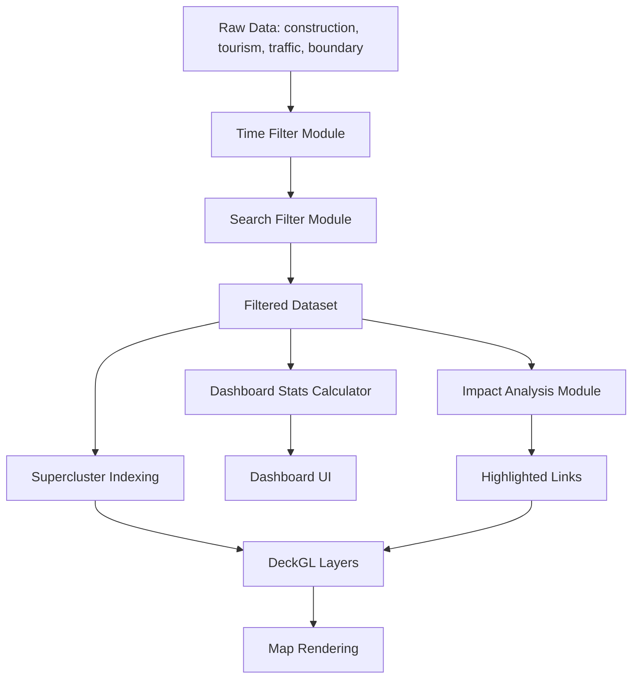

# Design Document: Digital Twin Enhancements

## Overview

This design document specifies the architecture and implementation approach for five enhancement features to the Digital Twin map system: Time-Axis Filtering, Layer Quality Enhancement, Status Dashboard, Spatial Search and Filtering, and Event Impact Analysis.

The Digital Twin system is a web-based 3D map visualization built with **DeckGL** and **MapLibre**, displaying construction sites, tourist attractions, traffic links, and administrative boundaries. The system uses **Supercluster** for efficient point clustering at different zoom levels and **React hooks** for state management.

### Design Goals

1. **Modularity**: Each enhancement should be implemented as a separate, reusable module
2. **Performance**: All features must maintain 60fps rendering and respond within specified time constraints
3. **Maintainability**: Clear separation of concerns between data processing, state management, and rendering
4. **Extensibility**: Architecture should support future enhancements without major refactoring

### Implementation Priority

Based on complexity and value delivery:

1. **Time-Axis Filtering** (Requirement 5) - Simplest, high value
2. **Layer Quality Enhancement** (Requirement 4) - Builds on existing infrastructure
3. **Status Dashboard** (Requirement 2) - Straightforward aggregation
4. **Spatial Search and Filtering** (Requirement 1) - Moderate complexity
5. **Event Impact Analysis** (Requirement 3) - Most complex, requires spatial algorithms

## Architecture

### High-Level Component Structure

```
TwinMap (Main Component)
├── Data Layer
│   ├── TimeFilterModule (new)
│   ├── SearchFilterModule (new)
│   └── ImpactAnalysisModule (new)
├── State Management
│   ├── useTwinMapFunction (existing, extended)
│   ├── useTimeFilter (new)
│   ├── useSearchFilter (new)
│   ├── useDashboardStats (new)
│   └── useImpactAnalysis (new)
├── Rendering Layer
│   ├── Enhanced Layer Renderers (modified)
│   │   ├── createConstructionClusterLayers (enhanced)
│   │   ├── createThemeTravelClusterLayers (enhanced)
│   │   └── createPathLayer (enhanced)
│   └── UI Components
│       ├── TimeFilterPanel (new)
│       ├── SearchPanel (new)
│       ├── DashboardPanel (new)
│       └── ImpactAnalysisPanel (new)
└── Utilities
    ├── spatialUtils.ts (new)
    ├── dateUtils.ts (new)
    ├── searchUtils.ts (new)
    └── iconUtils.ts (existing, enhanced)
```

### Data Flow



## Components and Interfaces

### 1. Time Filter Module

**Purpose**: Filter construction projects by date range and ongoing status.

**Location**: `component/dt/modules/TimeFilterModule.ts`

**Interface**:
```typescript
interface TimeFilterConfig {
  startDate: Date | null;
  endDate: Date | null;
  ongoingOnly: boolean;
}

interface TimeFilterModule {
  filterConstructionByDate(
    data: ConstructionPoint[],
    config: TimeFilterConfig
  ): ConstructionPoint[];
  
  isProjectInRange(
    project: ConstructionPoint,
    config: TimeFilterConfig
  ): boolean;
}
```

**Key Functions**:
- `filterConstructionByDate`: Filters construction array based on date range and ongoing toggle
- `isProjectInRange`: Checks if a single project matches filter criteria
- Date overlap logic: Project period overlaps selected range OR (ongoing mode AND current date is between project start/end)

### 2. Search Filter Module

**Purpose**: Search and filter locations by text, spatial radius, and combined criteria.

**Location**: `component/dt/modules/SearchFilterModule.ts`

**Interface**:
```typescript
interface SearchQuery {
  text?: string;
  districtName?: string;
  constructionField?: string;
  dateRange?: { start: Date; end: Date };
  spatialRadius?: { center: [number, number]; radius: number };
}

interface SearchResult<T> {
  items: T[];
  totalCount: number;
  page: number;
  pageSize: number;
}

interface SearchFilterModule {
  searchConstruction(
    data: ConstructionPoint[],
    query: SearchQuery,
    page: number
  ): SearchResult<ConstructionPoint>;
  
  searchTourism(
    data: ThemeTravelPoint[],
    query: SearchQuery,
    page: number
  ): SearchResult<ThemeTravelPoint>;
  
  searchBoundaries(
    data: BoundaryFeature[],
    query: SearchQuery
  ): BoundaryFeature[];
  
  isWithinRadius(
    point: [number, number],
    center: [number, number],
    radiusMeters: number
  ): boolean;
}
```

**Key Functions**:
- `searchConstruction`: Full-text search with pagination (50 items/page)
- `searchTourism`: Full-text search with pagination
- `searchBoundaries`: District name search (no pagination needed)
- `isWithinRadius`: Haversine distance calculation for spatial filtering
- Partial text matching using case-insensitive substring search

### 3. Dashboard Stats Module

**Purpose**: Calculate and aggregate statistics for display.

**Location**: `component/dt/modules/DashboardStatsModule.ts`

**Interface**:
```typescript
interface DashboardStats {
  ongoingProjects: number;
  projectsByField: Record<string, number>;
  projectsByDistrict: Record<string, number>;
  avgProgressRate: number;
  behindScheduleCount: number;
  tourismByCategory: Record<string, number>;
}

interface DashboardStatsModule {
  calculateStats(
    construction: ConstructionPoint[],
    tourism: ThemeTravelPoint[],
    boundaries: BoundaryFeature[]
  ): DashboardStats;
  
  getProjectsInViewport(
    construction: ConstructionPoint[],
    bbox: [number, number, number, number]
  ): ConstructionPoint[];
}
```

**Key Functions**:
- `calculateStats`: Computes all dashboard metrics
- `getProjectsInViewport`: Filters projects within current map bounds
- Grouping by field_code (F01-F08) and district name
- Behind schedule detection: `progress_rate < plan_rate`

### 4. Impact Analysis Module

**Purpose**: Analyze spatial relationships between construction/tourism sites and traffic links.

**Location**: `component/dt/modules/ImpactAnalysisModule.ts`

**Interface**:
```typescript
interface ImpactAnalysisResult {
  affectedLinkIds: string[];
  affectedLinkCount: number;
  avgTrafficSpeed: number;
  congestionLevel: 'low' | 'medium' | 'high';
}

interface ImpactAnalysisModule {
  analyzeConstructionImpact(
    construction: ConstructionPoint,
    links: LinkFeature[],
    trafficData: TrafficData[],
    radiusMeters: number
  ): ImpactAnalysisResult;
  
  analyzeTourismImpact(
    tourism: ThemeTravelPoint,
    links: LinkFeature[],
    trafficData: TrafficData[],
    radiusMeters: number
  ): ImpactAnalysisResult;
  
  findLinksWithinRadius(
    center: [number, number],
    links: LinkFeature[],
    radiusMeters: number
  ): LinkFeature[];
  
  calculateCongestionLevel(avgSpeed: number): 'low' | 'medium' | 'high';
}
```

**Key Functions**:
- `analyzeConstructionImpact`: Finds affected links within radius (default 500m)
- `analyzeTourismImpact`: Finds affected links within radius (default 300m)
- `findLinksWithinRadius`: Spatial query using point-to-line distance
- `calculateCongestionLevel`: Speed thresholds: low (>40 km/h), medium (20-40), high (<20)
- Performance target: <1s for 1000 links

### 5. Enhanced Layer Renderers

**Purpose**: Improve visual representation with progress-based colors, category icons, and detailed popups.

**Location**: `component/dt/layers/createClusterLayers.ts` (modified)

**Interface**:
```typescript
interface EnhancedConstructionLayer {
  getIconUrl(fieldCode: string): string;
  getFillColor(progressRate: number): [number, number, number, number];
  getPopupContent(construction: ConstructionPoint): string;
}

interface EnhancedTourismLayer {
  getIconUrl(categoryName: string): string;
  getPopupContent(tourism: ThemeTravelPoint): string;
}
```

**Color Scheme for Construction Progress**:
- 0-25%: Red `[255, 0, 0, 255]`
- 26-50%: Orange `[255, 165, 0, 255]`
- 51-75%: Yellow `[255, 255, 0, 255]`
- 76-99%: Green `[0, 255, 0, 255]`
- 100%: Blue `[0, 0, 255, 255]`

**Icon Mapping**:
- Construction: Field-specific icons (F01-F08) from existing `FIELD_CONFIG`
- Tourism: Category-specific icons from existing `THEME_CONFIG`

### 6. React Hooks for State Management

**useTimeFilter Hook**:
```typescript
interface UseTimeFilterReturn {
  config: TimeFilterConfig;
  setStartDate: (date: Date | null) => void;
  setEndDate: (date: Date | null) => void;
  toggleOngoingOnly: () => void;
  filteredConstruction: ConstructionPoint[];
  visibleCount: number;
}
```

**useSearchFilter Hook**:
```typescript
interface UseSearchFilterReturn {
  query: SearchQuery;
  setQuery: (query: Partial<SearchQuery>) => void;
  searchResults: SearchResult<any>;
  currentPage: number;
  setPage: (page: number) => void;
  executeSearch: () => void;
}
```

**useDashboardStats Hook**:
```typescript
interface UseDashboardStatsReturn {
  stats: DashboardStats;
  isLoading: boolean;
  refreshStats: () => void;
}
```

**useImpactAnalysis Hook**:
```typescript
interface UseImpactAnalysisReturn {
  selectedSite: ConstructionPoint | ThemeTravelPoint | null;
  selectSite: (site: any) => void;
  impactResult: ImpactAnalysisResult | null;
  radius: number;
  setRadius: (r: number) => void;
  highlightedLinks: string[];
}
```

## Data Models

### Extended ConstructionPoint

```typescript
interface ConstructionPoint {
  gid: number;
  lng: number;
  lat: number;
  project_name: string | null;
  progress_rate: number | null;
  plan_rate: number | null;
  achievement_rate: number | null;
  start_date: string | null;  // ISO 8601 format
  end_date: string | null;    // ISO 8601 format
  location_text: string | null;
  budget_text: string | null;
  d_day: number | null;
  summary: string | null;
  contact: string | null;
  field_code: string | null;  // F01-F08
  
  // Computed fields (not in DB)
  isOngoing?: boolean;
  isBehindSchedule?: boolean;
  districtName?: string;  // Derived from spatial join with boundaries
}
```

### Extended ThemeTravelPoint

```typescript
interface ThemeTravelPoint {
  gid: number;
  lng: number;
  lat: number;
  content_name: string | null;
  district_name: string | null;
  category_name: string | null;
  place_name: string | null;
  title: string | null;
  subtitle: string | null;
  address: string | null;
  phone: string | null;
  operating_hours: string | null;
  fee_info: string | null;
  closed_days: string | null;
}
```

### LinkFeature

```typescript
interface LinkFeature {
  lkId: string;
  path: [number, number][];  // Array of [lng, lat] coordinates
  speed?: number;  // From trafficData
}
```

### BoundaryFeature

```typescript
interface BoundaryFeature {
  id: number;
  code: string;
  name: string;  // District name (동 이름)
  contour: number[][];  // Polygon coordinates
}
```

## Data Models (continued)

### SearchIndex

For efficient text search, we'll build in-memory search indices:

```typescript
interface SearchIndex {
  construction: Map<string, ConstructionPoint[]>;  // Key: normalized search term
  tourism: Map<string, ThemeTravelPoint[]>;
  boundaries: Map<string, BoundaryFeature[]>;
}
```

**Indexing Strategy**:
- Tokenize all searchable text fields (project_name, location_text, content_name, place_name, district_name)
- Normalize to lowercase
- Build inverted index for O(1) lookup
- Rebuild index when data changes


## Correctness Properties

*A property is a characteristic or behavior that should hold true across all valid executions of a system—essentially, a formal statement about what the system should do. Properties serve as the bridge between human-readable specifications and machine-verifiable correctness guarantees.*

### Property Reflection

After analyzing all acceptance criteria, I identified the following properties and performed redundancy elimination:

**Redundancies Identified:**
1. Properties 1.1, 1.2, 1.3 (text search for boundaries, construction, tourism) can be combined into a single generic text search property
2. Properties 3.1 and 3.4 (spatial query for construction and tourism) can be combined into a single spatial query property
3. Properties 2.2 and 2.3 (grouping by field_code and district) can be combined into a single grouping property
4. Properties 4.4, 4.5, 4.6 (popup content for construction, tourism, links) can be combined into a single popup content property
5. Properties 5.3 and 5.4 (ongoing detection and filtering) are logically equivalent and can be combined

**Final Property Set (after consolidation):**

### Property 1: Text Search Correctness

*For any* dataset (boundaries, construction, or tourism) and any search query string, all returned items SHALL contain the search query as a case-insensitive substring in at least one searchable text field (name, project_name, content_name, place_name, location_text).

**Validates: Requirements 1.1, 1.2, 1.3, 1.6**

### Property 2: Spatial Radius Filtering

*For any* center point [lng, lat], radius in meters (100-2000), and dataset of points, all returned items SHALL be within the specified radius when measured using Haversine distance, and no items outside the radius SHALL be returned.

**Validates: Requirements 1.4, 3.1, 3.4, 3.6**

### Property 3: Multi-Condition Filter Intersection

*For any* set of filter conditions (text, district, field, date range, spatial) applied to a dataset, the result SHALL be equivalent to the intersection of results from each individual filter applied separately.

**Validates: Requirements 1.5**

### Property 4: Pagination Correctness

*For any* dataset with N items and page size P, requesting page number K SHALL return items from index [K×P, min((K+1)×P, N)), and the total page count SHALL equal ⌈N/P⌉.

**Validates: Requirements 1.7**

### Property 5: Counting with Filter Conditions

*For any* dataset and filter predicate, the count of filtered items SHALL equal the length of the array after applying the filter predicate.

**Validates: Requirements 2.1, 2.5, 5.5**

### Property 6: Grouping Invariants

*For any* dataset and grouping key (field_code, district_name, category_name), the sum of counts across all groups SHALL equal the total dataset size, and each group SHALL contain only items with the matching key value.

**Validates: Requirements 2.2, 2.3, 2.6**

### Property 7: Average Calculation Bounds

*For any* non-empty dataset of numeric values, the calculated average SHALL be greater than or equal to the minimum value and less than or equal to the maximum value. For a dataset where all values are equal to V, the average SHALL equal V.

**Validates: Requirements 2.4, 3.3**

### Property 8: Set Union Without Duplication

*For any* multiple selections (construction sites, tourist attractions), the aggregated set of affected items (links, areas) SHALL be the union of individual selection results with no duplicate items.

**Validates: Requirements 3.7**

### Property 9: Threshold-Based Classification

*For any* numeric value and set of threshold ranges with associated categories, the assigned category SHALL match the range containing the value. Specifically:
- Progress rate color: 0-25% → red, 26-50% → orange, 51-75% → yellow, 76-99% → green, 100% → blue
- Congestion level: <20 km/h → high, 20-40 km/h → medium, >40 km/h → low

**Validates: Requirements 3.5, 4.1**

### Property 10: Configuration Lookup Correctness

*For any* configuration key (field_code, category_name) and configuration map, the returned value (icon URL, color, label) SHALL match the configured value for that key, or the default value if the key is not found.

**Validates: Requirements 4.2, 4.3**

### Property 11: Content Inclusion in Generated Strings

*For any* data object (construction, tourism, link) and list of required fields, the generated popup/display string SHALL contain all non-null field values from the required fields list.

**Validates: Requirements 4.4, 4.5, 4.6**

### Property 12: Date Range Overlap Detection

*For any* two date ranges [start1, end1] and [start2, end2], the ranges overlap if and only if (start1 ≤ end2) AND (end1 ≥ start2). A project with date range [project_start, project_end] SHALL be included in filter results if its range overlaps the selected filter range.

**Validates: Requirements 5.2**

### Property 13: Point-in-Interval Detection

*For any* date interval [start, end] and point date D, the point is contained in the interval if and only if (D ≥ start) AND (D ≤ end). A project SHALL be classified as ongoing if the current date is contained in its [start_date, end_date] interval.

**Validates: Requirements 5.3, 5.4**

### Property 14: Filter-Cluster Data Flow

*For any* dataset and filter function, when the filtered dataset is passed to the clustering algorithm, the cluster input SHALL be identical to the filter output (no data loss or modification in the pipeline).

**Validates: Requirements 5.6**


## Error Handling

### Input Validation

**Search Module**:
- Empty or whitespace-only search queries: Return empty results, do not throw errors
- Invalid radius values (<100m or >2000m): Clamp to valid range [100, 2000]
- Null or undefined center coordinates: Throw `InvalidCoordinatesError`
- Invalid date formats: Throw `InvalidDateFormatError` with helpful message

**Dashboard Module**:
- Empty datasets: Return zero counts and null averages, do not throw errors
- Null or undefined progress_rate/plan_rate: Treat as 0 for calculations
- Division by zero (empty dataset average): Return 0 or null, not NaN

**Impact Analysis Module**:
- Invalid radius: Clamp to [100, 2000] range
- Empty link dataset: Return empty result with zero counts
- Null coordinates: Skip item and log warning, do not crash
- Missing traffic data: Use null/undefined speed, mark as "no data"

**Time Filter Module**:
- start_date > end_date: Swap dates automatically or show validation error
- Null dates with ongoing toggle: Use current date as reference
- Invalid date strings: Show user-friendly error message

### Performance Degradation

**Large Dataset Handling**:
- Search results >10,000 items: Show warning, limit to first 10,000
- Spatial queries >5,000 links: Use spatial indexing (R-tree) for optimization
- Dashboard calculations >50,000 items: Debounce viewport updates to 500ms

**Memory Management**:
- Search indices: Rebuild only when data changes, not on every search
- Cluster indices: Reuse Supercluster instances, don't recreate on every render
- Highlighted link sets: Use Set data structure for O(1) lookup

### Error Recovery

**Network Failures**:
- API fetch errors: Show toast notification, retry with exponential backoff
- Timeout errors: Cancel request after 10s, show "slow connection" message

**Rendering Errors**:
- DeckGL layer errors: Catch in error boundary, show fallback UI
- Invalid GeoJSON: Log error, skip invalid features, render valid ones

**State Corruption**:
- Invalid filter state: Reset to default values
- Corrupted session storage: Clear and reinitialize

## Testing Strategy

### Dual Testing Approach

This feature requires both **property-based testing** (for core logic) and **example-based unit/integration tests** (for UI, performance, and integration points).

### Property-Based Testing

**Framework**: Use **fast-check** (JavaScript/TypeScript property-based testing library)

**Configuration**:
- Minimum 100 iterations per property test
- Each test must reference its design document property using a comment tag
- Tag format: `// Feature: digital-twin-enhancements, Property {number}: {property_text}`

**Property Test Coverage**:

1. **Text Search (Property 1)**:
   - Generator: Random datasets with varying text fields, random search queries
   - Assertion: All results contain query substring (case-insensitive)

2. **Spatial Filtering (Property 2)**:
   - Generator: Random center points, radii (100-2000), point datasets
   - Assertion: All results within radius, no results outside radius (Haversine distance)

3. **Filter Intersection (Property 3)**:
   - Generator: Random datasets, random combinations of filters
   - Assertion: Multi-filter result equals intersection of individual filter results

4. **Pagination (Property 4)**:
   - Generator: Random datasets (size 0-1000), random page numbers
   - Assertion: Correct slice returned, correct page count

5. **Counting (Property 5)**:
   - Generator: Random datasets, random filter predicates
   - Assertion: Count equals filtered array length

6. **Grouping (Property 6)**:
   - Generator: Random datasets with grouping keys
   - Assertion: Sum of group counts equals total, each group contains only matching items

7. **Average Calculation (Property 7)**:
   - Generator: Random numeric arrays (non-empty)
   - Assertion: Average within [min, max], uniform array average equals value

8. **Set Union (Property 8)**:
   - Generator: Random multiple selections
   - Assertion: Result is union with no duplicates (Set size equals unique count)

9. **Threshold Classification (Property 9)**:
   - Generator: Random progress rates (0-100), random speeds (0-100)
   - Assertion: Assigned category matches threshold range

10. **Configuration Lookup (Property 10)**:
    - Generator: Random field codes, category names (including invalid ones)
    - Assertion: Returned value matches config or default

11. **Content Inclusion (Property 11)**:
    - Generator: Random data objects with varying null/non-null fields
    - Assertion: Generated string contains all non-null required fields

12. **Date Overlap (Property 12)**:
    - Generator: Random date range pairs
    - Assertion: Overlap detection matches mathematical condition

13. **Point-in-Interval (Property 13)**:
    - Generator: Random date intervals and point dates
    - Assertion: Containment detection matches mathematical condition

14. **Filter-Cluster Pipeline (Property 14)**:
    - Generator: Random datasets and filters
    - Assertion: Cluster input equals filter output (deep equality)

### Example-Based Unit Tests

**UI Component Tests** (using React Testing Library):
- TimeFilterPanel: Date input rendering, toggle behavior
- SearchPanel: Input handling, result display
- DashboardPanel: Stat display, click handlers
- ImpactAnalysisPanel: Radius slider, result display

**Integration Tests**:
- Search result selection → map animation (1.8)
- Dashboard stat click → map filtering (2.8)
- Viewport change → dashboard update timing (2.7)
- Impact analysis performance with 1000 links (3.8)
- Popup render timing <100ms (4.7)
- Session storage persistence (5.7)
- Time filter performance with 10,000 projects (5.8)

**Visual Regression Tests**:
- Icon visibility at zoom levels 12-18 (4.8)
- Color scheme correctness for progress rates
- Popup layout and formatting

### Performance Benchmarks

**Target Metrics**:
- Search with pagination: <100ms for 10,000 items
- Dashboard stats calculation: <500ms for 50,000 items
- Spatial query (1000 links): <1000ms
- Time filter application: <500ms for 10,000 projects
- Popup render: <100ms

**Benchmark Suite**:
- Use `performance.now()` for timing measurements
- Run each benchmark 10 times, report median and p95
- Fail test if p95 exceeds target by >20%

### Test File Organization

```
Next.js/test/
├── __tests__/
│   ├── modules/
│   │   ├── TimeFilterModule.property.test.ts
│   │   ├── SearchFilterModule.property.test.ts
│   │   ├── DashboardStatsModule.property.test.ts
│   │   ├── ImpactAnalysisModule.property.test.ts
│   │   └── LayerRenderers.property.test.ts
│   ├── components/
│   │   ├── TimeFilterPanel.test.tsx
│   │   ├── SearchPanel.test.tsx
│   │   ├── DashboardPanel.test.tsx
│   │   └── ImpactAnalysisPanel.test.tsx
│   ├── integration/
│   │   ├── search-integration.test.ts
│   │   ├── dashboard-integration.test.ts
│   │   └── impact-analysis-integration.test.ts
│   └── performance/
│       ├── search-performance.bench.ts
│       ├── dashboard-performance.bench.ts
│       └── spatial-query-performance.bench.ts
```

### Test Data Generators

**fast-check Arbitraries**:

```typescript
// Example generator for ConstructionPoint
const constructionPointArb = fc.record({
  gid: fc.integer({ min: 1, max: 100000 }),
  lng: fc.double({ min: 128.0, max: 130.0 }),
  lat: fc.double({ min: 34.0, max: 36.0 }),
  project_name: fc.string({ minLength: 5, maxLength: 50 }),
  progress_rate: fc.integer({ min: 0, max: 100 }),
  plan_rate: fc.integer({ min: 0, max: 100 }),
  start_date: fc.date({ min: new Date('2020-01-01'), max: new Date('2025-12-31') }),
  end_date: fc.date({ min: new Date('2020-01-01'), max: new Date('2025-12-31') }),
  field_code: fc.constantFrom('F01', 'F02', 'F03', 'F04', 'F05', 'F06', 'F07', 'F08'),
  // ... other fields
});
```

## Implementation Notes

### Phase 1: Time-Axis Filtering (Simplest)

**Files to Create**:
- `component/dt/modules/TimeFilterModule.ts`
- `component/dt/hooks/useTimeFilter.ts`
- `component/dt/panels/TimeFilterPanel.tsx`
- `component/dt/utils/dateUtils.ts`

**Files to Modify**:
- `component/TwinMap.tsx`: Integrate time filter, pass filtered data to Supercluster

**Key Implementation Details**:
- Use `dayjs` for date parsing and comparison (already in dependencies)
- Store filter state in React state, persist to sessionStorage on change
- Apply filter before passing data to Supercluster indices
- Show filtered count in panel header

### Phase 2: Layer Quality Enhancement

**Files to Create**:
- `component/dt/utils/colorUtils.ts` (progress rate → color mapping)

**Files to Modify**:
- `component/dt/layers/createClusterLayers.ts`: Add progress-based colors, enhanced popups
- `component/dt/utils/iconUtils.ts`: Extend with progress rate color function
- `component/TwinMap.tsx`: Update hover handlers with enhanced popup content

**Key Implementation Details**:
- Use existing `FIELD_CONFIG` and `THEME_CONFIG` for icons
- Create `getProgressColor(rate: number): [r, g, b, a]` function
- Format popup content with line breaks and emoji for readability
- Ensure popup positioning doesn't go off-screen

### Phase 3: Status Dashboard

**Files to Create**:
- `component/dt/modules/DashboardStatsModule.ts`
- `component/dt/hooks/useDashboardStats.ts`
- `component/dt/panels/DashboardPanel.tsx`

**Files to Modify**:
- `component/TwinMap.tsx`: Add dashboard panel, wire up click handlers

**Key Implementation Details**:
- Calculate stats in `useMemo` to avoid recalculation on every render
- Debounce viewport change updates to 500ms using `useDebouncedValue`
- Use grid layout for stat cards with hover effects
- Clicking a stat filters the map (sets filter state in parent)

### Phase 4: Spatial Search and Filtering

**Files to Create**:
- `component/dt/modules/SearchFilterModule.ts`
- `component/dt/hooks/useSearchFilter.ts`
- `component/dt/panels/SearchPanel.tsx`
- `component/dt/utils/searchUtils.ts` (text normalization, indexing)

**Files to Modify**:
- `component/TwinMap.tsx`: Add search panel, handle result selection

**Key Implementation Details**:
- Build search index on mount and when data changes
- Use `String.prototype.toLowerCase()` for case-insensitive matching
- Implement pagination with "Previous" and "Next" buttons
- Animate camera to selected result using `setViewState` with `transitionDuration`

### Phase 5: Event Impact Analysis

**Files to Create**:
- `component/dt/modules/ImpactAnalysisModule.ts`
- `component/dt/hooks/useImpactAnalysis.ts`
- `component/dt/panels/ImpactAnalysisPanel.tsx`
- `component/dt/utils/spatialUtils.ts` (Haversine distance, point-to-line distance)

**Files to Modify**:
- `component/TwinMap.tsx`: Add impact panel, handle site selection
- `component/dt/layers/createBaseLayers.ts`: Support impact highlight color (gold)

**Key Implementation Details**:
- Implement Haversine distance for point-to-point calculations
- For point-to-line distance, calculate distance to nearest point on each line segment
- Use R-tree spatial index for large link datasets (>5000 links)
- Show radius circle overlay on map when site is selected
- Display affected link count and average speed in panel

### Spatial Algorithms

**Haversine Distance** (point-to-point):
```typescript
function haversineDistance(
  [lng1, lat1]: [number, number],
  [lng2, lat2]: [number, number]
): number {
  const R = 6371000; // Earth radius in meters
  const φ1 = lat1 * Math.PI / 180;
  const φ2 = lat2 * Math.PI / 180;
  const Δφ = (lat2 - lat1) * Math.PI / 180;
  const Δλ = (lng2 - lng1) * Math.PI / 180;
  
  const a = Math.sin(Δφ/2) * Math.sin(Δφ/2) +
            Math.cos(φ1) * Math.cos(φ2) *
            Math.sin(Δλ/2) * Math.sin(Δλ/2);
  const c = 2 * Math.atan2(Math.sqrt(a), Math.sqrt(1-a));
  
  return R * c;
}
```

**Point-to-LineString Distance**:
```typescript
function pointToLineDistance(
  point: [number, number],
  line: [number, number][]
): number {
  let minDist = Infinity;
  
  for (let i = 0; i < line.length - 1; i++) {
    const segmentDist = pointToSegmentDistance(point, line[i], line[i+1]);
    minDist = Math.min(minDist, segmentDist);
  }
  
  return minDist;
}

function pointToSegmentDistance(
  point: [number, number],
  segStart: [number, number],
  segEnd: [number, number]
): number {
  // Project point onto line segment, clamp to segment bounds
  // Calculate distance to projected point
  // (Implementation details omitted for brevity)
}
```

### Performance Optimization

**Spatial Indexing**:
- For datasets >5000 links, use R-tree (e.g., `rbush` library)
- Build index once, reuse for multiple queries
- Bounding box pre-filter before precise distance calculation

**Memoization**:
- Memoize expensive calculations (stats, search indices) with `useMemo`
- Use `React.memo` for panel components to prevent unnecessary re-renders
- Cache icon URLs and color calculations

**Debouncing**:
- Debounce viewport change events (500ms) for dashboard updates
- Debounce search input (300ms) to avoid excessive filtering

**Lazy Loading**:
- Load search panel only when user opens it (code splitting)
- Defer impact analysis calculations until user selects a site

## Conclusion

This design provides a modular, testable, and performant architecture for enhancing the Digital Twin map system. The five features are designed to be implemented incrementally, with clear interfaces and separation of concerns. Property-based testing ensures correctness of core logic, while integration and performance tests validate end-to-end behavior and user experience.

The implementation follows React and DeckGL best practices, leveraging existing infrastructure (Supercluster, hooks, layer system) while adding new capabilities in a maintainable way.
