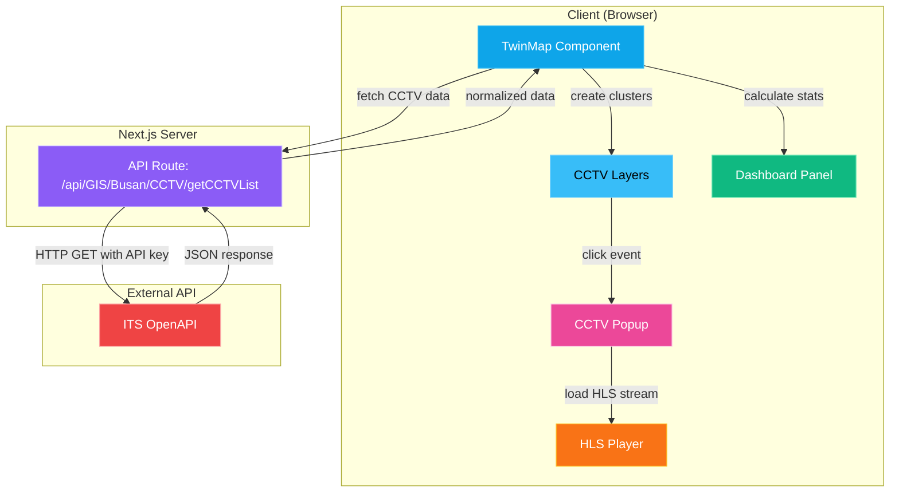

# Design Document: ITS CCTV 통합 기능

## Overview

이 설계 문서는 디지털 트윈 지도(TwinMap)에 국토교통부 ITS(Intelligent Transport Systems) 도로 CCTV 통합 기능을 추가하기 위한 기술 설계를 정의합니다. 이 기능은 부산 지역의 실시간 도로 CCTV 데이터를 ITS OpenAPI로부터 가져와 지도에 표시하고, 사용자가 CCTV 마커를 클릭하여 HLS(HTTP Live Streaming) 방식의 실시간 영상을 볼 수 있도록 합니다.

### 주요 목표

1. **데이터 통합**: ITS API로부터 부산 지역 CCTV 데이터를 서버 측에서 안전하게 가져오기
2. **시각화**: 기존 마커 패턴(공사현장, 관광지, 버스정류장)과 일관된 사이버펑크 스타일의 CCTV 마커 표시
3. **상호작용**: CCTV 마커 클릭 시 HLS 영상 플레이어 팝업 제공
4. **통계**: 대시보드에 CCTV 개수 통계 추가
5. **성능**: Supercluster를 활용한 효율적인 클러스터링 및 렌더링

### 기술 스택

- **Backend**: Next.js API Routes (서버 측 데이터 페칭)
- **Frontend**: React, TypeScript, deck.gl, MapLibre GL
- **Clustering**: Supercluster (radius: 80, maxZoom: 18)
- **Video Player**: hls.js (HLS 스트리밍 재생)
- **Styling**: 사이버펑크 테마 (cyan 색상, glow 효과, backdrop blur)

## Architecture

### 시스템 아키텍처



### 데이터 흐름

1. **초기 로드**:
   - TwinMap 컴포넌트가 마운트되면 `/api/GIS/Busan/CCTV/getCCTVList` 호출
   - API 라우트가 ITS OpenAPI에 요청 (API 키 포함)
   - ITS API 응답을 정규화하여 클라이언트에 반환
   - TwinMap이 데이터를 상태에 저장

2. **클러스터링**:
   - Supercluster 인덱스 생성 (useMemo로 메모이제이션)
   - 현재 viewport bounds와 zoom level에 따라 클러스터 계산
   - 개별 마커와 클러스터 마커를 deck.gl 레이어로 렌더링

3. **상호작용**:
   - 마커 hover 시 tooltip 표시 (CCTV 이름, 위치)
   - 마커 클릭 시 CCTV Popup 열기
   - HLS Player가 CCTV URL로부터 스트림 로드
   - 팝업 닫기 버튼 클릭 시 팝업 닫기

4. **통계**:
   - Dashboard Panel이 CCTV 데이터 개수 계산
   - 통계 카드에 CCTV 개수 표시

## Components and Interfaces

### 1. API Route: `/api/GIS/Busan/CCTV/getCCTVList`

**파일 경로**: `app/api/GIS/Busan/CCTV/getCCTVList/route.ts`

**책임**:
- ITS OpenAPI로부터 CCTV 데이터 페칭
- API 키 관리 (환경 변수)
- 데이터 정규화 및 변환
- 에러 처리

**인터페이스**:

```typescript
// Request
GET /api/GIS/Busan/CCTV/getCCTVList

// Response (Success)
{
  "data": [
    {
      "gid": number,
      "lng": number,
      "lat": number,
      "name": string,
      "url": string,
      "type": string,
      "format": string
    }
  ]
}

// Response (Error)
{
  "error": string,
  "details": string
}
```

**구현 세부사항**:

```typescript
// ITS API 요청 파라미터
const ITS_API_URL = "https://openapi.its.go.kr:9443/cctvInfo";
const params = {
  apiKey: process.env.ITS_CCTV_KEY,
  type: "4", // HLS HTTPS streaming
  cctvType: "4",
  minX: "128.8",
  maxX: "129.3",
  minY: "34.9",
  maxY: "35.4",
  getType: "json"
};

// 데이터 변환
const normalizedData = rawData.map((item, index) => ({
  gid: index + 1,
  lng: parseFloat(item.coordx),
  lat: parseFloat(item.coordy),
  name: item.cctvname,
  url: item.cctvurl,
  type: item.cctvtype,
  format: item.cctvformat
}));
```

### 2. TwinMap Component 확장

**파일 경로**: `component/TwinMap.tsx`

**추가 상태**:

```typescript
interface CCTVPoint {
  gid: number;
  lng: number;
  lat: number;
  name: string;
  url: string;
  type: string;
  format: string;
}

const [cctvData, setCctvData] = useState<CCTVPoint[]>([]);
const [selectedCctv, setSelectedCctv] = useState<CCTVPoint | null>(null);
const [isCctvPopupOpen, setIsCctvPopupOpen] = useState(false);
```

**데이터 페칭**:

```typescript
useEffect(() => {
  fetch("/api/GIS/Busan/CCTV/getCCTVList")
    .then(res => res.json())
    .then(data => {
      if (data.data) {
        setCctvData(data.data);
      }
    })
    .catch(err => {
      console.error("Failed to fetch CCTV data:", err);
    });
}, []);
```

**Supercluster 인덱스**:

```typescript
const cctvIndex = useMemo(() => {
  const sc = new Supercluster({ radius: 80, maxZoom: 18, minZoom: 0 });
  sc.load(
    (cctvData || [])
      .filter((c) => c.lat && c.lng)
      .map((c) => ({
        type: "Feature" as const,
        geometry: { 
          type: "Point" as const, 
          coordinates: [c.lng, c.lat] as [number, number] 
        },
        properties: c,
      }))
  );
  return sc;
}, [cctvData]);

const cctvClusters = useMemo(
  () => cctvIndex.getClusters(bbox, zoomInt),
  [cctvIndex, bbox, zoomInt]
);
```

**레이어 통합**:

```typescript
const cctvLayers = createCctvClusterLayers(cctvClusters, {
  onMarkerClick: (cctv: CCTVPoint) => {
    setSelectedCctv(cctv);
    setIsCctvPopupOpen(true);
  }
});

// DeckGL layers prop
layers={[
  boundaryLayer,
  ...bitLayers,
  ...constructionLayers,
  ...themeTravelLayers,
  ...cctvLayers,  // CCTV 레이어 추가
  pathLayer,
]}
```

**Tooltip 처리**:

```typescript
onHover={(info: any) => {
  // ... 기존 tooltip 로직 ...
  
  if (info.layer?.id === "cctv-point-core" && info.object) {
    const p = info.object.properties as CCTVPoint;
    setTooltip({
      x: info.x,
      y: info.y,
      content: `📹 ${p.name ?? "CCTV"}\n📍 ${p.lat.toFixed(4)}, ${p.lng.toFixed(4)}`,
    });
  } else if (info.layer?.id === "cctv-cluster-layer" && info.object) {
    setTooltip({
      x: info.x,
      y: info.y,
      content: `📹 CCTV ${info.object.properties.point_count}개`,
    });
  }
  // ...
}}
```

### 3. CCTV Cluster Layers

**파일 경로**: `component/dt/layers/createClusterLayers.ts`

**새 함수 추가**: `createCctvClusterLayers`

**레이어 구조** (사이버펑크 스타일):

1. **Cluster Glow Layer**: 클러스터 외부 글로우 효과
2. **Cluster Layer**: 클러스터 원형 테두리
3. **Cluster Text Layer**: 클러스터 내 CCTV 개수 텍스트
4. **Point Glow Layer**: 개별 마커 외부 글로우
5. **Point Ring Layer**: 개별 마커 중간 링
6. **Point Core Layer**: 개별 마커 내부 코어 (클릭 가능)
7. **Point Dot Layer**: 개별 마커 중심 도트

**색상 스킴**:
- Primary: `#38bdf8` (cyan)
- Glow: `rgba(56, 189, 248, 0.4)`
- Stroke: `#7dd3fc` (light cyan)
- Text: `#bae6fd` (very light cyan)

**구현**:

```typescript
export function createCctvClusterLayers(
  cctvClusters: any[],
  options?: { onMarkerClick?: (cctv: CCTVPoint) => void }
) {
  const { onMarkerClick } = options || {};

  // 1. Cluster Glow
  const cctvClusterGlow = new ScatterplotLayer({
    id: "cctv-cluster-glow",
    data: cctvClusters.filter((c: any) => c.properties.cluster),
    getPosition: (d: any) => d.geometry.coordinates,
    getRadius: (d: any) => {
      const count = d.properties.point_count;
      return 12 + Math.log2(count) * 3;
    },
    getFillColor: [56, 189, 248, 20],
    getLineColor: [56, 189, 248, 0],
    lineWidthMinPixels: 0,
    stroked: false,
    filled: true,
    radiusUnits: "pixels",
    pickable: false,
  });

  // 2. Cluster Layer
  const cctvClusterLayer = new ScatterplotLayer({
    id: "cctv-cluster-layer",
    data: cctvClusters.filter((c: any) => c.properties.cluster),
    getPosition: (d: any) => d.geometry.coordinates,
    getRadius: (d: any) => {
      const count = d.properties.point_count;
      return 10 + Math.log2(count) * 3;
    },
    getFillColor: [56, 189, 248, 0],
    getLineColor: [125, 211, 252, 200],
    lineWidthMinPixels: 1.8,
    stroked: true,
    filled: false,
    radiusUnits: "pixels",
    pickable: true,
  });

  // 3. Cluster Text
  const cctvClusterText = new TextLayer({
    id: "cctv-cluster-text",
    data: cctvClusters.filter((c: any) => c.properties.cluster),
    getPosition: (d: any) => d.geometry.coordinates,
    getText: (d: any) => String(d.properties.point_count),
    getSize: 11,
    getColor: [186, 230, 253, 255],
    getTextAnchor: "middle",
    getAlignmentBaseline: "center",
    fontWeight: "600",
    fontFamily: "system-ui",
  });

  // 4. Point Glow
  const cctvPointGlow = new ScatterplotLayer({
    id: "cctv-point-glow",
    data: cctvClusters.filter((c: any) => !c.properties.cluster),
    getPosition: (d: any) => d.geometry.coordinates,
    getRadius: 20,
    getFillColor: [56, 189, 248, 40],
    getLineColor: [125, 211, 252, 0],
    lineWidthMinPixels: 0,
    stroked: false,
    filled: true,
    radiusUnits: "pixels",
    pickable: false,
  });

  // 5. Point Ring
  const cctvPointRing = new ScatterplotLayer({
    id: "cctv-point-ring",
    data: cctvClusters.filter((c: any) => !c.properties.cluster),
    getPosition: (d: any) => d.geometry.coordinates,
    getRadius: 12,
    getFillColor: [0, 0, 0, 0],
    getLineColor: [125, 211, 252, 255],
    lineWidthMinPixels: 2,
    stroked: true,
    filled: false,
    radiusUnits: "pixels",
    pickable: false,
  });

  // 6. Point Core (clickable)
  const cctvPointCore = new ScatterplotLayer({
    id: "cctv-point-core",
    data: cctvClusters.filter((c: any) => !c.properties.cluster),
    getPosition: (d: any) => d.geometry.coordinates,
    getRadius: 8,
    getFillColor: [56, 189, 248, 200],
    getLineColor: [56, 189, 248, 255],
    lineWidthMinPixels: 1.5,
    stroked: true,
    filled: true,
    radiusUnits: "pixels",
    pickable: true,
    onClick: (info: any) => {
      if (onMarkerClick && info.object) {
        onMarkerClick(info.object.properties);
      }
    },
  });

  // 7. Point Dot
  const cctvPointDot = new ScatterplotLayer({
    id: "cctv-point-dot",
    data: cctvClusters.filter((c: any) => !c.properties.cluster),
    getPosition: (d: any) => d.geometry.coordinates,
    getRadius: 3,
    getFillColor: [255, 255, 255, 255],
    getLineColor: [0, 0, 0, 0],
    lineWidthMinPixels: 0,
    stroked: false,
    filled: true,
    radiusUnits: "pixels",
    pickable: false,
  });

  return [
    cctvClusterGlow,
    cctvClusterLayer,
    cctvClusterText,
    cctvPointGlow,
    cctvPointRing,
    cctvPointCore,
    cctvPointDot,
  ];
}
```

### 4. CCTV Popup Component

**파일 경로**: `component/dt/popups/CctvPopup.tsx`

**Props**:

```typescript
interface CctvPopupProps {
  cctv: CCTVPoint;
  isOpen: boolean;
  onClose: () => void;
}
```

**구현**:

```typescript
"use client";

import { useEffect, useRef, useState } from "react";
import Hls from "hls.js";

interface CctvPopupProps {
  cctv: {
    name: string;
    url: string;
    lat: number;
    lng: number;
  };
  isOpen: boolean;
  onClose: () => void;
}

export default function CctvPopup({ cctv, isOpen, onClose }: CctvPopupProps) {
  const videoRef = useRef<HTMLVideoElement>(null);
  const hlsRef = useRef<Hls | null>(null);
  const [error, setError] = useState<string | null>(null);
  const [isLoading, setIsLoading] = useState(true);

  useEffect(() => {
    if (!isOpen || !videoRef.current) return;

    setIsLoading(true);
    setError(null);

    const video = videoRef.current;

    // HLS 지원 확인
    if (Hls.isSupported()) {
      const hls = new Hls({
        enableWorker: true,
        lowLatencyMode: true,
      });

      hlsRef.current = hls;

      hls.loadSource(cctv.url);
      hls.attachMedia(video);

      hls.on(Hls.Events.MANIFEST_PARSED, () => {
        setIsLoading(false);
        video.play().catch((err) => {
          console.error("Video play error:", err);
          setError("영상 재생에 실패했습니다");
        });
      });

      hls.on(Hls.Events.ERROR, (event, data) => {
        console.error("HLS error:", data);
        setIsLoading(false);

        if (data.fatal) {
          switch (data.type) {
            case Hls.ErrorTypes.NETWORK_ERROR:
              setError("네트워크 오류가 발생했습니다");
              break;
            case Hls.ErrorTypes.MEDIA_ERROR:
              setError("영상을 불러올 수 없습니다");
              break;
            default:
              setError("알 수 없는 오류가 발생했습니다");
              break;
          }
        }
      });
    } else if (video.canPlayType("application/vnd.apple.mpegurl")) {
      // Safari native HLS support
      video.src = cctv.url;
      video.addEventListener("loadedmetadata", () => {
        setIsLoading(false);
        video.play().catch((err) => {
          console.error("Video play error:", err);
          setError("영상 재생에 실패했습니다");
        });
      });
    } else {
      setError("지원하지 않는 영상 형식입니다");
      setIsLoading(false);
    }

    return () => {
      if (hlsRef.current) {
        hlsRef.current.destroy();
        hlsRef.current = null;
      }
    };
  }, [isOpen, cctv.url]);

  if (!isOpen) return null;

  return (
    <div
      style={{
        position: "fixed",
        top: "50%",
        left: "50%",
        transform: "translate(-50%, -50%)",
        background: "rgba(10, 14, 26, 0.92)",
        backdropFilter: "blur(16px)",
        WebkitBackdropFilter: "blur(16px)",
        border: "1px solid rgba(56, 189, 248, 0.2)",
        borderRadius: "12px",
        padding: "20px",
        zIndex: 1000,
        width: "640px",
        maxWidth: "90vw",
        boxShadow: "0 8px 32px rgba(0, 0, 0, 0.5), 0 0 20px rgba(56, 189, 248, 0.3)",
      }}
    >
      {/* Header */}
      <div
        style={{
          display: "flex",
          justifyContent: "space-between",
          alignItems: "center",
          marginBottom: "16px",
        }}
      >
        <h3
          style={{
            color: "#38bdf8",
            fontSize: "16px",
            fontWeight: 700,
            margin: 0,
          }}
        >
          📹 {cctv.name}
        </h3>
        <button
          onClick={onClose}
          style={{
            background: "transparent",
            border: "1px solid rgba(56, 189, 248, 0.3)",
            borderRadius: "6px",
            color: "#38bdf8",
            cursor: "pointer",
            fontSize: "18px",
            padding: "4px 12px",
            transition: "all 0.2s",
          }}
          onMouseEnter={(e) => {
            e.currentTarget.style.background = "rgba(56, 189, 248, 0.1)";
            e.currentTarget.style.borderColor = "rgba(56, 189, 248, 0.6)";
          }}
          onMouseLeave={(e) => {
            e.currentTarget.style.background = "transparent";
            e.currentTarget.style.borderColor = "rgba(56, 189, 248, 0.3)";
          }}
        >
          ✕
        </button>
      </div>

      {/* Video Player */}
      <div
        style={{
          position: "relative",
          width: "100%",
          paddingBottom: "56.25%", // 16:9 aspect ratio
          background: "#000",
          borderRadius: "8px",
          overflow: "hidden",
        }}
      >
        {isLoading && (
          <div
            style={{
              position: "absolute",
              top: "50%",
              left: "50%",
              transform: "translate(-50%, -50%)",
              color: "#38bdf8",
              fontSize: "14px",
            }}
          >
            로딩 중...
          </div>
        )}

        {error && (
          <div
            style={{
              position: "absolute",
              top: "50%",
              left: "50%",
              transform: "translate(-50%, -50%)",
              color: "#ef4444",
              fontSize: "14px",
              textAlign: "center",
            }}
          >
            {error}
          </div>
        )}

        <video
          ref={videoRef}
          style={{
            position: "absolute",
            top: 0,
            left: 0,
            width: "100%",
            height: "100%",
            display: error ? "none" : "block",
          }}
          controls
          muted
          playsInline
        />
      </div>

      {/* Info */}
      <div
        style={{
          marginTop: "12px",
          color: "#8b90a7",
          fontSize: "12px",
        }}
      >
        <p style={{ margin: "4px 0" }}>
          📍 위치: {cctv.lat.toFixed(4)}, {cctv.lng.toFixed(4)}
        </p>
      </div>
    </div>
  );
}
```

### 5. Dashboard Panel 확장

**파일 경로**: `component/dt/panels/DashboardPanel.tsx`

**Props 확장**:

```typescript
interface DashboardPanelProps {
  stats: DashboardStats & { totalCctv: number };
  // ... 기존 props
}
```

**CCTV 통계 카드 추가**:

```typescript
{/* CCTV Count */}
<div
  style={statCard}
  onClick={() => onStatClick?.('cctv', 'all')}
  role="button"
  tabIndex={0}
  aria-label={`도로 CCTV ${stats.totalCctv}개`}
  onKeyDown={(e) => {
    if (e.key === 'Enter' || e.key === ' ') {
      e.preventDefault();
      onStatClick?.('cctv', 'all');
    }
  }}
  onMouseEnter={(e) => {
    e.currentTarget.style.background = "rgba(56,189,248,0.08)";
    e.currentTarget.style.borderColor = "rgba(56,189,248,0.3)";
  }}
  onMouseLeave={(e) => {
    e.currentTarget.style.background = "rgba(255,255,255,0.03)";
    e.currentTarget.style.borderColor = "rgba(255,255,255,0.08)";
  }}
>
  <div style={{ display: "flex", justifyContent: "space-between", alignItems: "center" }}>
    <span style={{ color: "#8b90a7", fontSize: "12px" }}>📹 도로 CCTV</span>
    <span style={{ color: "#38bdf8", fontSize: "18px", fontWeight: 700 }}>
      {stats.totalCctv}
    </span>
  </div>
</div>
```

### 6. Dashboard Stats Hook 확장

**파일 경로**: `component/dt/hooks/useDashboardStats.ts`

**통계 계산 추가**:

```typescript
export interface DashboardStats {
  // ... 기존 필드
  totalCctv: number;
}

export function useDashboardStats(
  constructionData: ConstructionPoint[],
  themeTravelData: ThemeTravelPoint[],
  boundaryData: DistrictBoundary[],
  cctvData: CCTVPoint[]  // 새 파라미터
): { stats: DashboardStats; isLoading: boolean } {
  const [stats, setStats] = useState<DashboardStats>({
    // ... 기존 초기값
    totalCctv: 0,
  });

  useEffect(() => {
    // ... 기존 계산 로직
    
    const totalCctv = cctvData.length;

    setStats({
      // ... 기존 stats
      totalCctv,
    });
  }, [constructionData, themeTravelData, boundaryData, cctvData]);

  return { stats, isLoading: false };
}
```

## Data Models

### CCTVPoint

```typescript
interface CCTVPoint {
  gid: number;           // 고유 ID (클라이언트 측 생성)
  lng: number;           // 경도 (ITS API: coordx)
  lat: number;           // 위도 (ITS API: coordy)
  name: string;          // CCTV 이름 (ITS API: cctvname)
  url: string;           // HLS 스트림 URL (ITS API: cctvurl)
  type: string;          // CCTV 타입 (ITS API: cctvtype)
  format: string;        // 영상 포맷 (ITS API: cctvformat)
}
```

### ITS API Response

```typescript
interface ITSCctvResponse {
  response: {
    comMsgHeader: {
      responseTime: string;
      requestMsgID: string;
      responseMsgID: string;
      returnCode: string;
    };
    msgHeader: {
      queryTime: string;
      resultCode: string;
      resultMessage: string;
    };
    body: {
      items: Array<{
        cctvname: string;
        cctvurl: string;
        coordx: string;
        coordy: string;
        cctvtype: string;
        cctvformat: string;
      }>;
    };
  };
}
```

### Supercluster Feature

```typescript
interface CCTVFeature {
  type: "Feature";
  geometry: {
    type: "Point";
    coordinates: [number, number]; // [lng, lat]
  };
  properties: CCTVPoint;
}

interface CCTVCluster {
  type: "Feature";
  geometry: {
    type: "Point";
    coordinates: [number, number];
  };
  properties: {
    cluster: true;
    cluster_id: number;
    point_count: number;
    point_count_abbreviated: string;
  };
}
```

## Correctness Properties

*A property is a characteristic or behavior that should hold true across all valid executions of a system—essentially, a formal statement about what the system should do. Properties serve as the bridge between human-readable specifications and machine-verifiable correctness guarantees.*

이 기능은 주로 **외부 API 통합, UI 렌더링, 그리고 인프라 설정**으로 구성되어 있습니다. 대부분의 요구사항은 다음과 같이 분류됩니다:

- **Integration Tests**: ITS API 호출, Next.js API 라우트 (Requirements 1.1-1.4, 1.6, 2.1-2.5)
- **Example-based Tests**: UI 상호작용, 스타일링, 에러 처리 (Requirements 4.1-4.3, 4.7, 5.1, 5.3, 5.5, 6.1, 6.3, 6.5-6.10, 7.2-7.6, 9.1-9.5, 10.1-10.5)
- **Smoke Tests**: 환경 변수 설정 (Requirements 8.1-8.5)

그러나 일부 핵심 로직은 **순수 함수**이며 property-based testing에 적합합니다:

### Property 1: API 응답 파싱 및 변환

*For any* valid ITS API response structure, the data fetcher SHALL correctly parse all required fields (cctvname, coordx, coordy, cctvurl, cctvtype, cctvformat) and transform them into the normalized CCTVPoint structure with correct field mappings (coordx → lng, coordy → lat, cctvname → name, cctvurl → url).

**Validates: Requirements 1.5, 1.7**

### Property 2: Supercluster 인덱스 생성

*For any* array of valid CCTVPoint objects with lat/lng coordinates, the Supercluster index SHALL be successfully created and SHALL be able to return clusters for any valid bounding box query.

**Validates: Requirement 3.3**

### Property 3: 뷰포트 기반 클러스터 생성

*For any* valid viewport bounds (minX, minY, maxX, maxY) and zoom level (0-22), the TwinMap SHALL generate CCTV clusters that contain only points within the specified bounds.

**Validates: Requirement 3.4**

### Property 4: 줌 레벨 기반 렌더링 모드

*For any* zoom level, the layer creation function SHALL render individual markers when zoom >= 14 and SHALL render cluster markers when zoom < 14, ensuring that the rendering mode is determined solely by the zoom level.

**Validates: Requirements 4.4, 4.5**

### Property 5: 클러스터 카운트 정확성

*For any* CCTV cluster, the displayed point count SHALL exactly match the actual number of CCTV points contained in that cluster.

**Validates: Requirement 4.6**

### Property 6: 클러스터 크기 계산

*For any* cluster point count, the calculated cluster size SHALL follow the formula `10 + Math.log2(count) * 3` and SHALL be within the expected range for the given count.

**Validates: Requirement 4.8**

### Property 7: 마커 툴팁 포맷팅

*For any* CCTVPoint with a name, lat, and lng, the tooltip content SHALL be formatted as "📹 [name]\n📍 [lat], [lng]" with coordinates formatted to 4 decimal places.

**Validates: Requirement 5.2**

### Property 8: 클러스터 툴팁 포맷팅

*For any* cluster with a point count, the tooltip content SHALL be formatted as "📹 CCTV [count]개" where count is the cluster's point_count value.

**Validates: Requirement 5.4**

### Property 9: 대시보드 CCTV 카운트

*For any* CCTV dataset, the Dashboard Panel SHALL display a total count that exactly matches the length of the CCTV data array.

**Validates: Requirement 7.1**

## Error Handling

### API 레벨 에러 처리

1. **ITS API 실패**:
   - HTTP 에러 (4xx, 5xx): 500 상태 코드와 에러 메시지 반환
   - 네트워크 에러: 500 상태 코드와 "Network error" 메시지 반환
   - 타임아웃: 500 상태 코드와 "Request timeout" 메시지 반환

2. **환경 변수 누락**:
   - `ITS_CCTV_KEY` 없음: 500 상태 코드와 "API key not configured" 메시지 반환

3. **JSON 파싱 실패**:
   - 잘못된 JSON 형식: 500 상태 코드와 "Invalid API response" 메시지 반환

### 클라이언트 레벨 에러 처리

1. **CCTV 데이터 페칭 실패**:
   - 에러를 콘솔에 로깅
   - 빈 배열로 상태 초기화
   - 다른 지도 기능(공사현장, 관광지, 버스정류장)은 정상 렌더링 계속

2. **HLS 스트림 로딩 실패**:
   - **Network Error**: "네트워크 오류가 발생했습니다" 메시지 표시
   - **Media Error**: "영상을 불러올 수 없습니다" 메시지 표시
   - **Unsupported Format**: "지원하지 않는 영상 형식입니다" 메시지 표시
   - **Unknown Error**: "알 수 없는 오류가 발생했습니다" 메시지 표시

3. **Supercluster 에러**:
   - 잘못된 좌표 데이터: 해당 포인트를 필터링하여 제외
   - 빈 데이터셋: 빈 클러스터 배열 반환

### 에러 복구 전략

```typescript
// API Route Error Handling
try {
  const response = await fetch(ITS_API_URL, { params });
  if (!response.ok) {
    throw new Error(`ITS API error: ${response.status}`);
  }
  const data = await response.json();
  return NextResponse.json({ data: normalizeData(data) });
} catch (error) {
  console.error("CCTV data fetch error:", error);
  return NextResponse.json(
    { error: "Failed to fetch CCTV data", details: error.message },
    { status: 500 }
  );
}

// Client Error Handling
useEffect(() => {
  fetch("/api/GIS/Busan/CCTV/getCCTVList")
    .then(res => res.json())
    .then(data => {
      if (data.data) {
        setCctvData(data.data);
      }
    })
    .catch(err => {
      console.error("Failed to fetch CCTV data:", err);
      setCctvData([]); // Graceful degradation
    });
}, []);

// HLS Player Error Handling
hls.on(Hls.Events.ERROR, (event, data) => {
  if (data.fatal) {
    switch (data.type) {
      case Hls.ErrorTypes.NETWORK_ERROR:
        setError("네트워크 오류가 발생했습니다");
        hls.startLoad(); // Try to recover
        break;
      case Hls.ErrorTypes.MEDIA_ERROR:
        setError("영상을 불러올 수 없습니다");
        hls.recoverMediaError(); // Try to recover
        break;
      default:
        setError("알 수 없는 오류가 발생했습니다");
        break;
    }
  }
});
```

## Testing Strategy

이 기능은 **외부 API 통합, UI 렌더링, 그리고 순수 함수 로직**이 혼합되어 있으므로, 다음과 같은 **다층 테스트 전략**을 사용합니다:

### 1. Property-Based Tests (순수 함수 로직)

**대상**: 데이터 변환, 클러스터링 로직, 포맷팅 함수

**라이브러리**: `fast-check` (JavaScript/TypeScript용 property-based testing)

**테스트 구성**:
- 최소 100회 반복 실행
- 각 테스트는 design.md의 property를 참조하는 주석 포함
- 태그 형식: `// Feature: its-cctv-integration, Property N: [property text]`

**예시**:

```typescript
import fc from "fast-check";

// Feature: its-cctv-integration, Property 1: API 응답 파싱 및 변환
describe("CCTV Data Transformation", () => {
  it("should correctly parse and transform ITS API response", () => {
    fc.assert(
      fc.property(
        fc.array(
          fc.record({
            cctvname: fc.string(),
            coordx: fc.float({ min: 128.8, max: 129.3 }),
            coordy: fc.float({ min: 34.9, max: 35.4 }),
            cctvurl: fc.webUrl(),
            cctvtype: fc.constant("4"),
            cctvformat: fc.string(),
          })
        ),
        (apiResponse) => {
          const normalized = transformCctvData(apiResponse);
          
          expect(normalized).toHaveLength(apiResponse.length);
          normalized.forEach((item, index) => {
            expect(item.lng).toBe(apiResponse[index].coordx);
            expect(item.lat).toBe(apiResponse[index].coordy);
            expect(item.name).toBe(apiResponse[index].cctvname);
            expect(item.url).toBe(apiResponse[index].cctvurl);
          });
        }
      ),
      { numRuns: 100 }
    );
  });
});

// Feature: its-cctv-integration, Property 6: 클러스터 크기 계산
describe("Cluster Size Calculation", () => {
  it("should calculate cluster size according to formula", () => {
    fc.assert(
      fc.property(
        fc.integer({ min: 2, max: 1000 }),
        (pointCount) => {
          const expectedSize = 10 + Math.log2(pointCount) * 3;
          const actualSize = calculateClusterSize(pointCount);
          
          expect(actualSize).toBeCloseTo(expectedSize, 2);
        }
      ),
      { numRuns: 100 }
    );
  });
});

// Feature: its-cctv-integration, Property 7: 마커 툴팁 포맷팅
describe("Marker Tooltip Formatting", () => {
  it("should format tooltip content correctly", () => {
    fc.assert(
      fc.property(
        fc.record({
          name: fc.string({ minLength: 1 }),
          lat: fc.float({ min: 34.9, max: 35.4 }),
          lng: fc.float({ min: 128.8, max: 129.3 }),
        }),
        (cctv) => {
          const tooltip = formatCctvTooltip(cctv);
          
          expect(tooltip).toContain("📹");
          expect(tooltip).toContain(cctv.name);
          expect(tooltip).toContain(cctv.lat.toFixed(4));
          expect(tooltip).toContain(cctv.lng.toFixed(4));
        }
      ),
      { numRuns: 100 }
    );
  });
});
```

### 2. Integration Tests (API 통합)

**대상**: ITS API 호출, Next.js API 라우트

**도구**: Jest + MSW (Mock Service Worker)

**테스트 케이스**:
- ITS API 성공 응답 처리
- ITS API 에러 응답 처리 (4xx, 5xx)
- 네트워크 에러 처리
- API 키 누락 시나리오
- 응답 데이터 정규화 검증

**예시**:

```typescript
import { rest } from "msw";
import { setupServer } from "msw/node";

const server = setupServer(
  rest.get("https://openapi.its.go.kr:9443/cctvInfo", (req, res, ctx) => {
    return res(
      ctx.json({
        response: {
          body: {
            items: [
              {
                cctvname: "Test CCTV",
                coordx: "129.0",
                coordy: "35.1",
                cctvurl: "https://example.com/stream.m3u8",
                cctvtype: "4",
                cctvformat: "HLS",
              },
            ],
          },
        },
      })
    );
  })
);

describe("CCTV API Route", () => {
  it("should fetch and return CCTV data", async () => {
    const response = await fetch("/api/GIS/Busan/CCTV/getCCTVList");
    const data = await response.json();
    
    expect(response.status).toBe(200);
    expect(data.data).toHaveLength(1);
    expect(data.data[0].name).toBe("Test CCTV");
  });

  it("should handle ITS API errors", async () => {
    server.use(
      rest.get("https://openapi.its.go.kr:9443/cctvInfo", (req, res, ctx) => {
        return res(ctx.status(500));
      })
    );

    const response = await fetch("/api/GIS/Busan/CCTV/getCCTVList");
    const data = await response.json();
    
    expect(response.status).toBe(500);
    expect(data.error).toBeDefined();
  });
});
```

### 3. Component Tests (UI 렌더링 및 상호작용)

**대상**: TwinMap, CctvPopup, DashboardPanel

**도구**: React Testing Library + Jest

**테스트 케이스**:
- CCTV 데이터 페칭 및 상태 업데이트
- 마커 hover 시 tooltip 표시
- 마커 클릭 시 popup 열기
- Popup 닫기 버튼 동작
- Dashboard CCTV 통계 표시
- 에러 발생 시 graceful degradation

**예시**:

```typescript
import { render, screen, waitFor } from "@testing-library/react";
import userEvent from "@testing-library/user-event";
import TwinMap from "@/component/TwinMap";

describe("TwinMap CCTV Integration", () => {
  it("should fetch and display CCTV markers", async () => {
    render(<TwinMap {...mockProps} />);
    
    await waitFor(() => {
      expect(screen.getByText(/CCTV/)).toBeInTheDocument();
    });
  });

  it("should open popup when CCTV marker is clicked", async () => {
    const user = userEvent.setup();
    render(<TwinMap {...mockProps} />);
    
    const marker = await screen.findByRole("button", { name: /CCTV/ });
    await user.click(marker);
    
    expect(screen.getByText(/영상/)).toBeInTheDocument();
  });

  it("should continue rendering when CCTV fetch fails", async () => {
    // Mock fetch to fail
    global.fetch = jest.fn(() => Promise.reject("API error"));
    
    render(<TwinMap {...mockProps} />);
    
    // Other layers should still render
    expect(screen.getByText(/공사현장/)).toBeInTheDocument();
    expect(screen.getByText(/관광지/)).toBeInTheDocument();
  });
});
```

### 4. E2E Tests (전체 시나리오)

**대상**: 사용자 워크플로우

**도구**: Playwright 또는 Cypress

**테스트 시나리오**:
1. 지도 로드 → CCTV 마커 표시 확인
2. 줌 인/아웃 → 클러스터링 동작 확인
3. CCTV 마커 클릭 → 영상 플레이어 팝업 확인
4. 대시보드에서 CCTV 통계 확인

### 테스트 커버리지 목표

- **Unit Tests (Property + Example)**: 80% 이상
- **Integration Tests**: 주요 API 엔드포인트 100%
- **Component Tests**: 주요 UI 컴포넌트 70% 이상
- **E2E Tests**: 핵심 사용자 워크플로우 100%

### 테스트 실행 전략

```json
{
  "scripts": {
    "test": "jest",
    "test:unit": "jest --testPathPattern=unit",
    "test:integration": "jest --testPathPattern=integration",
    "test:component": "jest --testPathPattern=component",
    "test:e2e": "playwright test",
    "test:coverage": "jest --coverage"
  }
}
```

## Implementation Notes

### 환경 변수 설정

`.env.local` 파일에 다음 변수 추가:

```bash
ITS_CCTV_KEY=your_api_key_here
```

### 의존성 추가

```json
{
  "dependencies": {
    "hls.js": "^1.4.12",
    "supercluster": "^8.0.1"
  },
  "devDependencies": {
    "fast-check": "^3.15.0",
    "msw": "^2.0.0",
    "@testing-library/react": "^14.0.0",
    "@testing-library/user-event": "^14.5.0"
  }
}
```

### 파일 구조

```
app/
  api/
    GIS/
      Busan/
        CCTV/
          getCCTVList/
            route.ts          # API 라우트
component/
  dt/
    layers/
      createClusterLayers.ts  # CCTV 레이어 추가
    popups/
      CctvPopup.tsx          # 새 파일
    hooks/
      useDashboardStats.ts   # CCTV 통계 추가
    panels/
      DashboardPanel.tsx     # CCTV 카드 추가
  TwinMap.tsx                # CCTV 통합
types/
  cctv.ts                    # 새 파일 (CCTVPoint 인터페이스)
```

### 성능 고려사항

1. **Supercluster 메모이제이션**: `useMemo`로 인덱스 재생성 방지
2. **클러스터 계산 최적화**: viewport 변경 시에만 재계산
3. **HLS 스트림 정리**: 컴포넌트 언마운트 시 `hls.destroy()` 호출
4. **레이어 렌더링 순서**: CCTV 레이어를 다른 포인트 레이어와 동일한 z-index에 배치

### 보안 고려사항

1. **API 키 보호**: 서버 측에서만 사용, 클라이언트에 노출 금지
2. **CORS 처리**: ITS API 요청은 서버 측에서 수행
3. **입력 검증**: API 응답 데이터 검증 후 사용
4. **XSS 방지**: 사용자 입력 없음, API 데이터만 표시

### 접근성 고려사항

1. **키보드 네비게이션**: 팝업 닫기 버튼에 키보드 이벤트 추가
2. **ARIA 레이블**: 대시보드 카드에 `aria-label` 추가
3. **포커스 관리**: 팝업 열릴 때 포커스 이동
4. **색상 대비**: 사이버펑크 테마에서도 WCAG AA 기준 충족

## Conclusion

이 설계는 ITS CCTV 통합 기능을 기존 디지털 트윈 지도 시스템에 일관되게 통합하는 방법을 정의합니다. 주요 설계 결정사항:

1. **서버 측 데이터 페칭**: API 키 보안을 위해 Next.js API 라우트 사용
2. **일관된 시각화**: 기존 마커 패턴(공사현장, 관광지)과 동일한 사이버펑크 스타일 적용
3. **효율적인 클러스터링**: Supercluster를 활용한 성능 최적화
4. **실시간 영상 재생**: hls.js를 사용한 HLS 스트리밍 지원
5. **Graceful Degradation**: CCTV 데이터 실패 시에도 다른 기능 정상 동작
6. **다층 테스트 전략**: Property-based, Integration, Component, E2E 테스트 조합

이 설계를 따르면 사용자는 부산 지역의 실시간 도로 CCTV를 지도에서 직관적으로 탐색하고, 클릭 한 번으로 실시간 영상을 확인할 수 있습니다.
