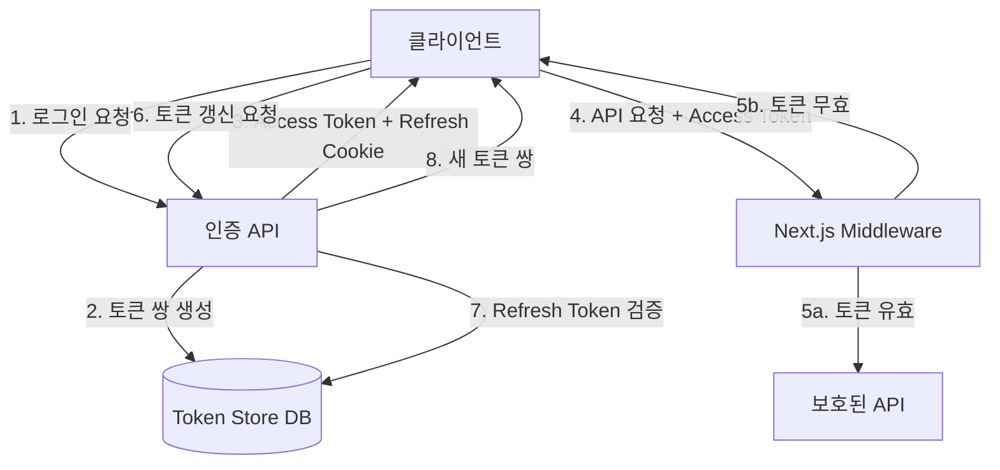
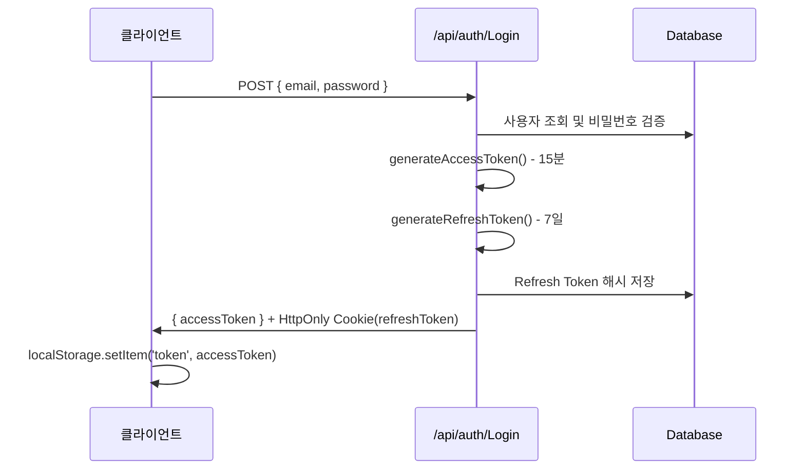
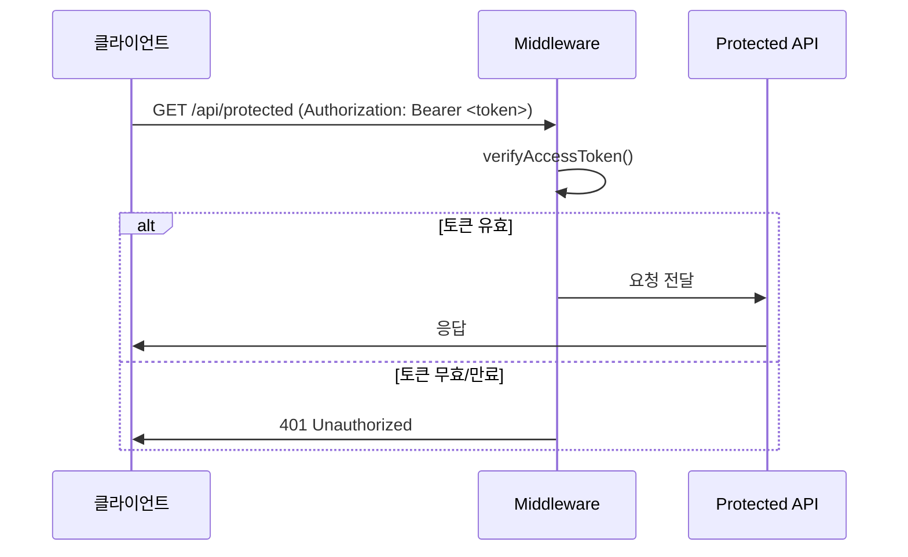
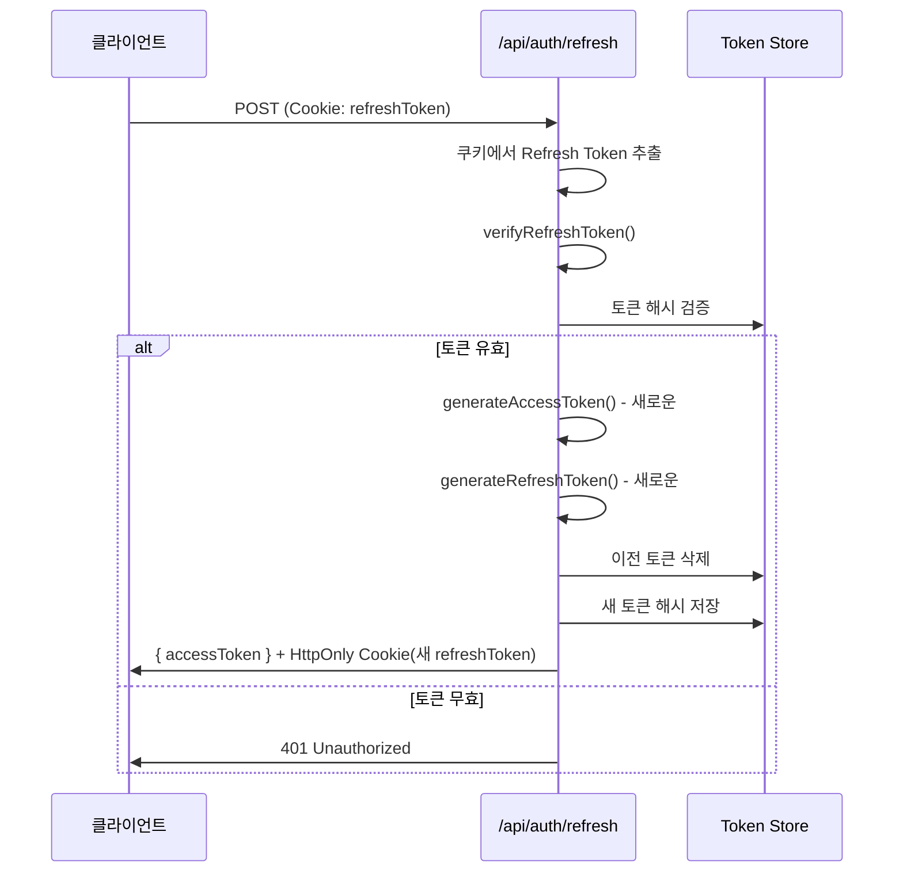

# JWT 리프레시 토큰 기능 설계 문서

## 개요

이 설계는 현재 단일 JWT 토큰 시스템을 액세스 토큰(Access Token)과 리프레시 토큰(Refresh Token)으로 분리된 이중 토큰 시스템으로 업그레이드합니다. Next.js 미들웨어를 활용하여 토큰 검증 및 자동 갱신 로직을 중앙화하고, HttpOnly 쿠키를 통해 보안을 강화합니다.

### 설계 목표

1. **보안 강화**: 짧은 수명의 액세스 토큰과 긴 수명의 리프레시 토큰 분리
2. **사용자 경험 개선**: 자동 토큰 갱신으로 재로그인 없이 서비스 지속 사용
3. **중앙화된 인증**: Next.js 미들웨어를 통한 일관된 인증 로직
4. **XSS 방어**: HttpOnly 쿠키를 통한 리프레시 토큰 보호
5. **토큰 무효화**: 데이터베이스 기반 토큰 관리로 즉시 무효화 가능

### 주요 변경 사항

- 기존 `generateToken()` → `generateAccessToken()`, `generateRefreshToken()` 분리
- 기존 `verifyToken()` → `verifyAccessToken()`, `verifyRefreshToken()` 분리
- 새로운 Prisma 모델 `refresh_tokens` 추가
- Next.js 미들웨어 구현으로 보호된 라우트 자동 검증
- 새로운 API 엔드포인트: `/api/auth/refresh`, `/api/auth/logout`

---

## 아키텍처

### 시스템 구조



### 토큰 흐름

#### 로그인 흐름


#### 인증 요청 흐름


#### 토큰 갱신 흐름


---

## 컴포넌트 및 인터페이스

### 1. 토큰 유틸리티 (`utils/auth.ts`)

#### 기존 함수 (하위 호환성 유지)
```typescript
// 기존 함수 - 내부적으로 generateAccessToken 호출
export function generateToken(user: { id: string; email: string }): string
export function verifyToken(token: string): JwtPayload | null
```

#### 새로운 함수
```typescript
// 액세스 토큰 생성 (15분 만료)
export function generateAccessToken(user: { 
  id: string; 
  email: string 
}): string

// 리프레시 토큰 생성 (7일 만료)
export function generateRefreshToken(user: { 
  id: string; 
  tokenVersion: number 
}): string

// 액세스 토큰 검증
export function verifyAccessToken(token: string): AccessTokenPayload | null

// 리프레시 토큰 검증
export function verifyRefreshToken(token: string): RefreshTokenPayload | null

// 토큰 해싱 (저장용)
export function hashToken(token: string): string
```

### 2. 토큰 저장소 서비스 (`lib/tokenStore.ts`)

```typescript
interface TokenStoreService {
  // 리프레시 토큰 저장
  saveRefreshToken(userId: string, tokenHash: string, expiresAt: Date): Promise<void>
  
  // 리프레시 토큰 검증
  verifyRefreshToken(userId: string, tokenHash: string): Promise<boolean>
  
  // 특정 토큰 삭제
  revokeRefreshToken(tokenHash: string): Promise<void>
  
  // 사용자의 모든 토큰 삭제 (로그아웃 또는 보안 위협 시)
  revokeAllUserTokens(userId: string): Promise<void>
  
  // 만료된 토큰 정리
  cleanupExpiredTokens(): Promise<number>
}
```

### 3. Next.js 미들웨어 (`middleware.ts`)

```typescript
import { NextResponse } from 'next/server'
import type { NextRequest } from 'next/server'
import { verifyAccessToken } from '@/utils/auth'

export function middleware(request: NextRequest) {
  // 보호된 라우트 패턴
  const protectedPaths = [
    '/api/post',
    '/api/qna',
    '/api/Comment',
    '/api/Chat',
    // ... 기타 보호된 경로
  ]
  
  // 공개 라우트 (인증 불필요)
  const publicPaths = [
    '/api/auth/Login',
    '/api/auth/Register',
    '/api/auth/refresh',
    '/api/auth/CheckDuplicate'
  ]
  
  const path = request.nextUrl.pathname
  
  // 공개 라우트는 통과
  if (publicPaths.some(p => path.startsWith(p))) {
    return NextResponse.next()
  }
  
  // 보호된 라우트 검증
  if (protectedPaths.some(p => path.startsWith(p))) {
    const authHeader = request.headers.get('Authorization')
    const token = authHeader?.split(' ')[1]
    
    if (!token) {
      return NextResponse.json(
        { error: 'Unauthorized: No token provided' },
        { status: 401 }
      )
    }
    
    const payload = verifyAccessToken(token)
    
    if (!payload) {
      return NextResponse.json(
        { error: 'Unauthorized: Invalid or expired token' },
        { status: 401 }
      )
    }
    
    // 검증된 사용자 정보를 헤더에 추가 (선택적)
    const requestHeaders = new Headers(request.headers)
    requestHeaders.set('X-User-Id', payload.id)
    requestHeaders.set('X-User-Email', payload.email)
    
    return NextResponse.next({
      request: {
        headers: requestHeaders,
      },
    })
  }
  
  return NextResponse.next()
}

export const config = {
  matcher: '/api/:path*'
}
```

### 4. API 엔드포인트

#### `/api/auth/Login` (수정)
```typescript
POST /api/auth/Login
Request: { email: string, password: string }
Response: {
  accessToken: string,
  user: { id: string, email: string, name: string }
}
Set-Cookie: refreshToken=<token>; HttpOnly; Secure; SameSite=Strict; Path=/; Max-Age=604800
```

#### `/api/auth/refresh` (신규)
```typescript
POST /api/auth/refresh
Request: (Cookie에서 자동 추출)
Response: {
  accessToken: string
}
Set-Cookie: refreshToken=<new_token>; HttpOnly; Secure; SameSite=Strict; Path=/; Max-Age=604800
```

#### `/api/auth/logout` (신규)
```typescript
POST /api/auth/logout
Request: (Cookie에서 자동 추출)
Response: {
  message: "Logged out successfully"
}
Set-Cookie: refreshToken=; HttpOnly; Secure; SameSite=Strict; Path=/; Max-Age=0
```

#### `/api/auth/Me` (수정)
```typescript
GET /api/auth/Me
Headers: Authorization: Bearer <accessToken>
Response: {
  id: string,
  email: string,
  name: string
}
```

---

## 데이터 모델

### Prisma 스키마 추가

```prisma
model refresh_tokens {
  id         Int      @id @default(autoincrement())
  user_id    Int
  token_hash String   @db.VarChar(255)
  expires_at DateTime @db.Timestamp(6)
  created_at DateTime @default(now()) @db.Timestamp(6)
  
  user       users    @relation(fields: [user_id], references: [id], onDelete: Cascade)
  
  @@index([user_id])
  @@index([token_hash])
  @@index([expires_at])
}

model users {
  id             Int              @id @default(autoincrement())
  name           String?          @db.VarChar(100)
  naver_id       String?          @db.VarChar(3000)
  email          String?          @unique @db.VarChar(255)
  password       String?          @db.VarChar(255)
  refresh_tokens refresh_tokens[]
}
```

### 토큰 페이로드 구조

#### Access Token Payload
```typescript
interface AccessTokenPayload {
  id: string        // 사용자 ID
  email: string     // 사용자 이메일
  iat: number       // 발급 시간
  exp: number       // 만료 시간 (15분 후)
}
```

#### Refresh Token Payload
```typescript
interface RefreshTokenPayload {
  id: string        // 사용자 ID
  tokenVersion: number  // 토큰 버전 (보안 위협 시 모든 토큰 무효화용)
  iat: number       // 발급 시간
  exp: number       // 만료 시간 (7일 후)
}
```

---

## 보안 고려사항

### 1. 토큰 저장 전략

| 토큰 타입 | 저장 위치 | 이유 |
|----------|----------|------|
| Access Token | localStorage | 클라이언트에서 API 요청 시 쉽게 접근 가능 |
| Refresh Token | HttpOnly Cookie | JavaScript 접근 불가로 XSS 공격 방어 |

### 2. 쿠키 보안 속성

```typescript
const cookieOptions = {
  httpOnly: true,      // JavaScript 접근 차단
  secure: true,        // HTTPS에서만 전송
  sameSite: 'strict',  // CSRF 공격 방어
  path: '/',           // 모든 경로에서 접근 가능
  maxAge: 7 * 24 * 60 * 60  // 7일 (초 단위)
}
```

### 3. 토큰 해싱

리프레시 토큰은 데이터베이스에 평문으로 저장하지 않고 SHA-256 해시로 저장합니다.

```typescript
import crypto from 'crypto'

export function hashToken(token: string): string {
  return crypto
    .createHash('sha256')
    .update(token)
    .digest('hex')
}
```

### 4. 토큰 로테이션 (Token Rotation)

리프레시 토큰 사용 시마다 새로운 리프레시 토큰을 발급하여 이전 토큰을 무효화합니다. 이는 토큰 탈취 시 피해를 최소화합니다.

### 5. 재사용 감지 (Reuse Detection)

동일한 리프레시 토큰이 짧은 시간 내에 여러 번 사용되면 보안 위협으로 간주하고 해당 사용자의 모든 토큰을 무효화합니다.

```typescript
// 토큰 재사용 감지 로직
const REUSE_WINDOW = 5000 // 5초

async function detectTokenReuse(tokenHash: string): Promise<boolean> {
  const recentUsage = await prisma.refresh_tokens.findFirst({
    where: {
      token_hash: tokenHash,
      created_at: {
        gte: new Date(Date.now() - REUSE_WINDOW)
      }
    }
  })
  
  return recentUsage !== null
}
```

### 6. 환경 변수 분리

```env
# 액세스 토큰용 시크릿
JWT_SECRET=your-access-token-secret-key-here

# 리프레시 토큰용 시크릿 (별도 관리)
REFRESH_SECRET=your-refresh-token-secret-key-here
```

---

## 정확성 속성 (Correctness Properties)

*속성(Property)은 시스템의 모든 유효한 실행에서 참이어야 하는 특성 또는 동작입니다. 본질적으로 시스템이 무엇을 해야 하는지에 대한 형식적 진술입니다. 속성은 사람이 읽을 수 있는 명세와 기계가 검증 가능한 정확성 보장 사이의 다리 역할을 합니다.*


### 속성 1: 액세스 토큰 만료 시간 정확성

*임의의* 유효한 사용자 정보에 대해, 생성된 액세스 토큰의 만료 시간은 발급 시간으로부터 정확히 15분(900초) 후여야 한다.

**검증: 요구사항 1.1**

### 속성 2: 리프레시 토큰 만료 시간 정확성

*임의의* 유효한 사용자 정보에 대해, 생성된 리프레시 토큰의 만료 시간은 발급 시간으로부터 정확히 7일(604800초) 후여야 한다.

**검증: 요구사항 1.2**

### 속성 3: 액세스 토큰 페이로드 보존

*임의의* 사용자 ID와 이메일에 대해, 액세스 토큰을 생성하고 디코딩했을 때 페이로드에 원본 ID와 이메일이 정확히 포함되어야 한다.

**검증: 요구사항 1.3**

### 속성 4: 리프레시 토큰 페이로드 보존

*임의의* 사용자 ID와 토큰 버전에 대해, 리프레시 토큰을 생성하고 디코딩했을 때 페이로드에 원본 ID와 토큰 버전이 정확히 포함되어야 한다.

**검증: 요구사항 1.4**

### 속성 5: Authorization 헤더 토큰 추출

*임의의* 토큰 문자열에 대해, "Bearer <token>" 형식의 Authorization 헤더에서 토큰을 추출했을 때 원본 토큰 문자열과 일치해야 한다.

**검증: 요구사항 3.1**

### 속성 6: 쿠키 토큰 추출

*임의의* 토큰 문자열에 대해, "refreshToken=<token>" 형식의 쿠키 헤더에서 토큰을 추출했을 때 원본 토큰 문자열과 일치해야 한다.

**검증: 요구사항 4.1**

### 속성 7: 무효한 토큰에 대한 일관된 에러 처리

*임의의* 무효한 토큰(만료된 토큰, 잘못된 서명, 형식 오류, DB에 없는 토큰 등)에 대해, 시스템은 401 Unauthorized 응답을 반환하고, 클라이언트에게는 구체적인 실패 이유를 노출하지 않는 일반적인 에러 메시지만 반환해야 한다.

**검증: 요구사항 3.3, 4.6, 7.2**

### 속성 8: 토큰 해싱 일관성

*임의의* 토큰 문자열에 대해, 동일한 입력은 항상 동일한 해시 값을 생성해야 하며, 해시 값은 원본 토큰과 달라야 한다.

**검증: 요구사항 6.2**

---

## 에러 처리

### 토큰 검증 실패

| 에러 유형 | HTTP 상태 | 클라이언트 메시지 | 서버 로그 |
|----------|----------|-----------------|----------|
| 토큰 없음 | 401 | "Unauthorized: No token provided" | "Missing Authorization header" |
| 토큰 만료 | 401 | "Unauthorized: Invalid or expired token" | "Token expired at {timestamp}" |
| 잘못된 서명 | 401 | "Unauthorized: Invalid or expired token" | "Invalid token signature" |
| 형식 오류 | 401 | "Unauthorized: Invalid or expired token" | "Malformed token: {error}" |
| DB에 없음 | 401 | "Unauthorized: Invalid or expired token" | "Token not found in store" |

### 토큰 재사용 감지

```typescript
// 보안 위협 시나리오
if (await detectTokenReuse(tokenHash)) {
  // 1. 해당 사용자의 모든 토큰 무효화
  await tokenStore.revokeAllUserTokens(userId)
  
  // 2. 보안 이벤트 로그
  logger.security({
    event: 'TOKEN_REUSE_DETECTED',
    userId,
    tokenHash,
    timestamp: new Date()
  })
  
  // 3. 401 응답 (클라이언트는 재로그인 필요)
  return NextResponse.json(
    { error: 'Unauthorized: Please log in again' },
    { status: 401 }
  )
}
```

### 데이터베이스 에러

```typescript
try {
  await tokenStore.saveRefreshToken(userId, tokenHash, expiresAt)
} catch (error) {
  logger.error('Failed to save refresh token', { userId, error })
  
  // 클라이언트에게는 일반적인 에러만 반환
  return NextResponse.json(
    { error: 'Internal server error' },
    { status: 500 }
  )
}
```

---

## 테스트 전략

### 이중 테스트 접근법

이 기능은 **단위 테스트**와 **속성 기반 테스트**를 모두 활용합니다:

#### 단위 테스트 (Unit Tests)
- 특정 예제 및 엣지 케이스 검증
- API 응답 형식 확인
- 쿠키 속성 검증
- 하위 호환성 확인
- 로깅 동작 검증

**예제:**
```typescript
describe('Login API', () => {
  it('should return accessToken in response body', async () => {
    const response = await fetch('/api/auth/Login', {
      method: 'POST',
      body: JSON.stringify({ email: 'test@example.com', password: 'password123' })
    })
    
    const data = await response.json()
    expect(data).toHaveProperty('accessToken')
  })
  
  it('should set refreshToken as HttpOnly cookie', async () => {
    const response = await fetch('/api/auth/Login', {
      method: 'POST',
      body: JSON.stringify({ email: 'test@example.com', password: 'password123' })
    })
    
    const setCookie = response.headers.get('Set-Cookie')
    expect(setCookie).toContain('refreshToken=')
    expect(setCookie).toContain('HttpOnly')
    expect(setCookie).toContain('Secure')
    expect(setCookie).toContain('SameSite=Strict')
  })
})
```

#### 속성 기반 테스트 (Property-Based Tests)

**테스트 라이브러리:** [fast-check](https://github.com/dubzzz/fast-check) (TypeScript/JavaScript용)

**설정:**
- 최소 100회 반복 실행
- 각 테스트는 설계 문서의 속성을 참조하는 태그 포함

**예제:**
```typescript
import fc from 'fast-check'
import { generateAccessToken, verifyAccessToken } from '@/utils/auth'

describe('Property-Based Tests', () => {
  // Feature: jwt-refresh-token, Property 1: 액세스 토큰 만료 시간 정확성
  it('should generate access tokens with exactly 15 minutes expiration', () => {
    fc.assert(
      fc.property(
        fc.record({
          id: fc.uuid(),
          email: fc.emailAddress()
        }),
        (user) => {
          const token = generateAccessToken(user)
          const payload = verifyAccessToken(token)
          
          expect(payload).not.toBeNull()
          const expirationDuration = payload!.exp - payload!.iat
          expect(expirationDuration).toBe(900) // 15분 = 900초
        }
      ),
      { numRuns: 100 }
    )
  })
  
  // Feature: jwt-refresh-token, Property 3: 액세스 토큰 페이로드 보존
  it('should preserve user ID and email in access token payload', () => {
    fc.assert(
      fc.property(
        fc.record({
          id: fc.uuid(),
          email: fc.emailAddress()
        }),
        (user) => {
          const token = generateAccessToken(user)
          const payload = verifyAccessToken(token)
          
          expect(payload).not.toBeNull()
          expect(payload!.id).toBe(user.id)
          expect(payload!.email).toBe(user.email)
        }
      ),
      { numRuns: 100 }
    )
  })
  
  // Feature: jwt-refresh-token, Property 7: 무효한 토큰에 대한 일관된 에러 처리
  it('should return 401 for any invalid token without exposing details', () => {
    fc.assert(
      fc.property(
        fc.oneof(
          fc.constant(''), // 빈 토큰
          fc.string(), // 임의의 문자열
          fc.constant('Bearer invalid.token.here'), // 잘못된 형식
          fc.constant(generateExpiredToken()) // 만료된 토큰
        ),
        async (invalidToken) => {
          const response = await fetch('/api/protected', {
            headers: { Authorization: `Bearer ${invalidToken}` }
          })
          
          expect(response.status).toBe(401)
          
          const data = await response.json()
          // 구체적인 실패 이유를 노출하지 않음
          expect(data.error).not.toContain('expired')
          expect(data.error).not.toContain('signature')
          expect(data.error).not.toContain('malformed')
        }
      ),
      { numRuns: 100 }
    )
  })
  
  // Feature: jwt-refresh-token, Property 8: 토큰 해싱 일관성
  it('should generate consistent hashes for same input', () => {
    fc.assert(
      fc.property(
        fc.string({ minLength: 10 }),
        (token) => {
          const hash1 = hashToken(token)
          const hash2 = hashToken(token)
          
          expect(hash1).toBe(hash2) // 일관성
          expect(hash1).not.toBe(token) // 원본과 다름
          expect(hash1).toHaveLength(64) // SHA-256 = 64자 hex
        }
      ),
      { numRuns: 100 }
    )
  })
})
```

#### 통합 테스트 (Integration Tests)

데이터베이스 상호작용 및 전체 인증 흐름을 검증합니다:

```typescript
describe('Token Refresh Flow', () => {
  it('should rotate refresh token on successful refresh', async () => {
    // 1. 로그인
    const loginRes = await fetch('/api/auth/Login', {
      method: 'POST',
      body: JSON.stringify({ email: 'test@example.com', password: 'password123' })
    })
    
    const oldRefreshToken = extractCookie(loginRes, 'refreshToken')
    const oldTokenHash = hashToken(oldRefreshToken)
    
    // 2. DB에 이전 토큰 존재 확인
    const oldToken = await prisma.refresh_tokens.findFirst({
      where: { token_hash: oldTokenHash }
    })
    expect(oldToken).not.toBeNull()
    
    // 3. 토큰 갱신
    const refreshRes = await fetch('/api/auth/refresh', {
      method: 'POST',
      headers: { Cookie: `refreshToken=${oldRefreshToken}` }
    })
    
    const newRefreshToken = extractCookie(refreshRes, 'refreshToken')
    const newTokenHash = hashToken(newRefreshToken)
    
    // 4. 이전 토큰 삭제 확인
    const deletedToken = await prisma.refresh_tokens.findFirst({
      where: { token_hash: oldTokenHash }
    })
    expect(deletedToken).toBeNull()
    
    // 5. 새 토큰 저장 확인
    const savedToken = await prisma.refresh_tokens.findFirst({
      where: { token_hash: newTokenHash }
    })
    expect(savedToken).not.toBeNull()
  })
})
```

### 테스트 커버리지 목표

- **단위 테스트**: API 엔드포인트, 유틸리티 함수, 미들웨어 로직
- **속성 기반 테스트**: 토큰 생성/검증, 해싱, 에러 처리
- **통합 테스트**: 전체 인증 흐름, 데이터베이스 상호작용, 토큰 로테이션
- **보안 테스트**: 토큰 재사용 감지, XSS/CSRF 방어

---

## 구현 우선순위

### Phase 1: 핵심 토큰 시스템
1. `utils/auth.ts` 확장 (토큰 생성/검증 함수)
2. Prisma 스키마 업데이트 및 마이그레이션
3. `lib/tokenStore.ts` 구현
4. `/api/auth/Login` 수정 (이중 토큰 발급)

### Phase 2: 토큰 갱신 및 로그아웃
5. `/api/auth/refresh` 구현
6. `/api/auth/logout` 구현
7. 토큰 로테이션 로직

### Phase 3: 미들웨어 및 보안
8. `middleware.ts` 구현
9. 토큰 재사용 감지
10. 에러 처리 및 로깅

### Phase 4: 테스트 및 문서화
11. 단위 테스트 작성
12. 속성 기반 테스트 작성
13. 통합 테스트 작성
14. API 문서 업데이트

---

## 마이그레이션 가이드

### 기존 시스템에서 마이그레이션

#### 1. 데이터베이스 마이그레이션

```bash
# Prisma 스키마 업데이트 후
npx prisma migrate dev --name add_refresh_tokens
npx prisma generate
```

#### 2. 환경 변수 추가

```env
# .env 파일에 추가
REFRESH_SECRET=your-new-refresh-secret-key-here
```

#### 3. 클라이언트 코드 업데이트

**기존:**
```typescript
const res = await fetch("/api/auth/Login", {
  method: "POST",
  body: JSON.stringify({ email, password }),
})

const { token } = await res.json()
localStorage.setItem("token", token)
```

**새로운:**
```typescript
const res = await fetch("/api/auth/Login", {
  method: "POST",
  body: JSON.stringify({ email, password }),
})

const { accessToken } = await res.json()
localStorage.setItem("token", accessToken)
// refreshToken은 자동으로 쿠키에 저장됨
```

#### 4. 토큰 갱신 로직 추가

```typescript
// 401 에러 시 자동 갱신 시도
async function fetchWithTokenRefresh(url: string, options: RequestInit) {
  let response = await fetch(url, options)
  
  if (response.status === 401) {
    // 토큰 갱신 시도
    const refreshRes = await fetch('/api/auth/refresh', {
      method: 'POST',
      credentials: 'include' // 쿠키 포함
    })
    
    if (refreshRes.ok) {
      const { accessToken } = await refreshRes.json()
      localStorage.setItem('token', accessToken)
      
      // 원래 요청 재시도
      const newOptions = {
        ...options,
        headers: {
          ...options.headers,
          Authorization: `Bearer ${accessToken}`
        }
      }
      response = await fetch(url, newOptions)
    } else {
      // 갱신 실패 - 로그인 페이지로 리다이렉트
      window.location.href = '/Login'
    }
  }
  
  return response
}
```

#### 5. 하위 호환성

기존 `generateToken()` 및 `verifyToken()` 함수는 유지되며, 내부적으로 새로운 함수를 호출합니다:

```typescript
// 하위 호환성을 위해 유지
export function generateToken(user: { id: string; email: string }): string {
  return generateAccessToken(user)
}

export function verifyToken(token: string): JwtPayload | null {
  return verifyAccessToken(token)
}
```

---

## 성능 고려사항

### 토큰 저장소 최적화

1. **인덱스 활용**: `user_id`, `token_hash`, `expires_at`에 인덱스 생성
2. **정기 정리**: 만료된 토큰을 주기적으로 삭제 (cron job 또는 serverless function)
3. **연결 풀링**: Prisma 연결 풀 설정 최적화

```typescript
// prisma/schema.prisma
model refresh_tokens {
  // ...
  @@index([user_id])
  @@index([token_hash])
  @@index([expires_at])
}
```

### 미들웨어 성능

- JWT 검증은 동기 작업이므로 빠름
- 데이터베이스 조회 없이 토큰 검증 가능 (액세스 토큰)
- 리프레시 토큰만 데이터베이스 조회 필요

### 캐싱 전략 (선택적)

Redis를 사용하여 리프레시 토큰 검증 성능 향상:

```typescript
// lib/tokenCache.ts (선택적)
import Redis from 'ioredis'

const redis = new Redis(process.env.REDIS_URL)

export async function cacheRefreshToken(
  userId: string,
  tokenHash: string,
  expiresAt: Date
) {
  const ttl = Math.floor((expiresAt.getTime() - Date.now()) / 1000)
  await redis.setex(`refresh:${tokenHash}`, ttl, userId)
}

export async function verifyRefreshTokenCache(
  tokenHash: string
): Promise<string | null> {
  return await redis.get(`refresh:${tokenHash}`)
}
```

---

## 보안 체크리스트

- [ ] 액세스 토큰은 15분 만료
- [ ] 리프레시 토큰은 7일 만료
- [ ] 리프레시 토큰은 HttpOnly 쿠키로 저장
- [ ] 쿠키에 Secure, SameSite=Strict 설정
- [ ] 리프레시 토큰은 해시로 데이터베이스에 저장
- [ ] JWT_SECRET과 REFRESH_SECRET 분리
- [ ] 토큰 로테이션 구현
- [ ] 토큰 재사용 감지 구현
- [ ] 에러 메시지에서 구체적인 실패 이유 숨김
- [ ] 모든 보안 이벤트 로깅
- [ ] HTTPS 환경에서만 운영
- [ ] 만료된 토큰 정기 정리

---

## 참고 자료

- [RFC 6749: OAuth 2.0 Authorization Framework](https://datatracker.ietf.org/doc/html/rfc6749)
- [RFC 7519: JSON Web Token (JWT)](https://datatracker.ietf.org/doc/html/rfc7519)
- [OWASP: JSON Web Token Cheat Sheet](https://cheatsheetseries.owasp.org/cheatsheets/JSON_Web_Token_for_Java_Cheat_Sheet.html)
- [Next.js Middleware Documentation](https://nextjs.org/docs/app/building-your-application/routing/middleware)
- [fast-check Documentation](https://github.com/dubzzz/fast-check)
