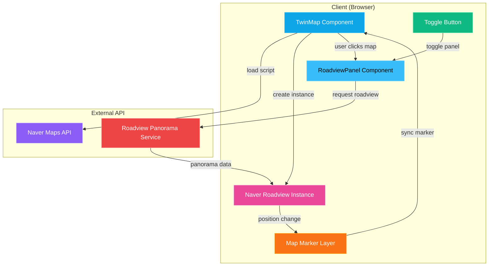

# Design Document: 네이버 로드뷰 통합 기능

## Overview

이 설계 문서는 디지털 트윈 지도(TwinMap)에 네이버 로드뷰(Naver Roadview) 기능을 통합하기 위한 기술 설계를 정의합니다. 이 기능은 사용자가 지도상의 특정 위치를 클릭하여 해당 위치의 실제 거리 뷰를 360도 파노라마로 볼 수 있도록 하며, 지도 데이터와 실제 거리 환경을 함께 확인할 수 있는 풍부한 공간 정보 경험을 제공합니다.

### 주요 목표

1. **로드뷰 통합**: 네이버 지도 API를 사용하여 로드뷰 기능을 디지털 트윈 페이지에 통합
2. **위치 기반 표시**: 지도 클릭 시 해당 위치의 로드뷰를 자동으로 표시
3. **UI/UX**: 토글 가능한 패널로 로드뷰를 표시하며, 반응형 레이아웃 지원
4. **지도 동기화**: 로드뷰 위치와 지도 마커를 실시간으로 동기화
5. **성능 최적화**: 지연 로딩, 캐싱, 조건부 데이터 요청으로 성능 최적화
6. **접근성**: 키보드 네비게이션 및 ARIA 속성 지원

### 기술 스택

- **Frontend**: React, TypeScript, Next.js
- **Map Library**: deck.gl, MapLibre GL
- **Roadview API**: Naver Maps API (Roadview)
- **Styling**: 사이버펑크 테마 (cyan 색상, glow 효과, backdrop blur)
- **State Management**: React Hooks (useState, useEffect, useRef, useMemo)

## Architecture

### 시스템 아키텍처



### 데이터 흐름

1. **초기화**:
   - TwinMap 컴포넌트가 마운트되면 네이버 지도 API 스크립트를 지연 로딩
   - API 키 검증 후 로드뷰 인스턴스 생성 준비
   - 토글 버튼을 UI에 렌더링

2. **로드뷰 표시**:
   - 사용자가 지도를 클릭하면 클릭 좌표 캡처
   - 로드뷰 패널이 열리고 해당 좌표로 로드뷰 요청
   - 네이버 API가 해당 위치의 로드뷰 존재 여부 확인
   - 로드뷰가 존재하면 파노라마 뷰 표시, 없으면 에러 메시지 표시
   - 지도에 로드뷰 위치 마커 표시

3. **위치 동기화**:
   - 로드뷰 내에서 위치 이동 시 (화살표 클릭)
   - 새로운 파노라마 로드
   - 지도 마커 위치 자동 업데이트
   - 마커 방향 아이콘도 현재 시야 방향에 맞춰 업데이트

4. **캐싱 및 최적화**:
   - 이전에 방문한 위치의 파노라마 데이터 캐싱
   - 패널이 닫혀있을 때는 로드뷰 데이터 요청하지 않음
   - 동일한 위치 재방문 시 캐시된 데이터 사용

## Components and Interfaces

### 1. TwinMap Component 확장

**파일 경로**: `component/TwinMap.tsx`

**추가 상태**:

```typescript
interface RoadviewState {
  isOpen: boolean;
  position: { lat: number; lng: number } | null;
  direction: number; // 방위각 (0-360)
  zoom: number; // 줌 레벨
  isAvailable: boolean; // 해당 위치에 로드뷰 존재 여부
}

const [roadviewState, setRoadviewState] = useState<RoadviewState>({
  isOpen: false,
  position: null,
  direction: 0,
  zoom: 0,
  isAvailable: false,
});

const [roadviewMarker, setRoadviewMarker] = useState<{ lat: number; lng: number } | null>(null);
```

**지도 클릭 핸들러**:

```typescript
const handleMapClick = (info: any) => {
  if (!info.coordinate) return;
  
  const [lng, lat] = info.coordinate;
  
  // 로드뷰 패널 열기 및 위치 설정
  setRoadviewState(prev => ({
    ...prev,
    isOpen: true,
    position: { lat, lng },
  }));
  
  // 마커 표시
  setRoadviewMarker({ lat, lng });
};
```

**토글 버튼 핸들러**:

```typescript
const toggleRoadviewPanel = () => {
  setRoadviewState(prev => ({
    ...prev,
    isOpen: !prev.isOpen,
  }));
};
```

**위치 동기화 핸들러**:

```typescript
const handleRoadviewPositionChange = (newPosition: { lat: number; lng: number }, direction: number) => {
  setRoadviewState(prev => ({
    ...prev,
    position: newPosition,
    direction,
  }));
  
  setRoadviewMarker(newPosition);
};
```

### 2. RoadviewPanel Component

**파일 경로**: `component/dt/panels/RoadviewPanel.tsx`

**Props**:

```typescript
interface RoadviewPanelProps {
  isOpen: boolean;
  position: { lat: number; lng: number } | null;
  onClose: () => void;
  onPositionChange: (position: { lat: number; lng: number }, direction: number) => void;
  onAvailabilityChange: (isAvailable: boolean) => void;
}
```

**구현**:

```typescript
"use client";

import { useEffect, useRef, useState } from "react";
import { useNaverRoadview } from "@/component/dt/hooks/useNaverRoadview";

interface RoadviewPanelProps {
  isOpen: boolean;
  position: { lat: number; lng: number } | null;
  onClose: () => void;
  onPositionChange: (position: { lat: number; lng: number }, direction: number) => void;
  onAvailabilityChange: (isAvailable: boolean) => void;
}

export default function RoadviewPanel({
  isOpen,
  position,
  onClose,
  onPositionChange,
  onAvailabilityChange,
}: RoadviewPanelProps) {
  const containerRef = useRef<HTMLDivElement>(null);
  const [panelWidth, setPanelWidth] = useState(40); // 기본 40%
  const [isResizing, setIsResizing] = useState(false);
  
  const {
    roadviewInstance,
    isLoading,
    error,
    isAvailable,
    initializeRoadview,
    setRoadviewPosition,
  } = useNaverRoadview({
    onPositionChange,
    onAvailabilityChange,
  });

  // 로드뷰 초기화
  useEffect(() => {
    if (isOpen && containerRef.current && !roadviewInstance) {
      initializeRoadview(containerRef.current);
    }
  }, [isOpen, roadviewInstance, initializeRoadview]);

  // 위치 변경 시 로드뷰 업데이트
  useEffect(() => {
    if (roadviewInstance && position && isOpen) {
      setRoadviewPosition(position);
    }
  }, [roadviewInstance, position, isOpen, setRoadviewPosition]);

  // 패널 크기 조절 핸들러
  const handleResize = (e: MouseEvent) => {
    if (!isResizing) return;
    
    const newWidth = (e.clientX / window.innerWidth) * 100;
    const clampedWidth = Math.max(
      (300 / window.innerWidth) * 100, // 최소 300px
      Math.min(newWidth, 60) // 최대 60%
    );
    
    setPanelWidth(clampedWidth);
  };

  useEffect(() => {
    if (isResizing) {
      window.addEventListener("mousemove", handleResize);
      window.addEventListener("mouseup", () => setIsResizing(false));
      
      return () => {
        window.removeEventListener("mousemove", handleResize);
        window.removeEventListener("mouseup", () => setIsResizing(false));
      };
    }
  }, [isResizing]);

  // 키보드 접근성
  useEffect(() => {
    if (isOpen && containerRef.current) {
      containerRef.current.focus();
    }
  }, [isOpen]);

  if (!isOpen) return null;

  // 반응형: 768px 미만에서는 전체 화면 오버레이
  const isMobile = typeof window !== "undefined" && window.innerWidth < 768;

  return (
    <div
      style={{
        position: "fixed",
        top: 0,
        right: 0,
        width: isMobile ? "100%" : `${panelWidth}%`,
        height: "100%",
        background: "rgba(10, 14, 26, 0.95)",
        backdropFilter: "blur(16px)",
        WebkitBackdropFilter: "blur(16px)",
        border: "1px solid rgba(56, 189, 248, 0.2)",
        borderRight: "none",
        zIndex: 1000,
        display: "flex",
        flexDirection: "column",
        boxShadow: "-4px 0 20px rgba(0, 0, 0, 0.5), 0 0 20px rgba(56, 189, 248, 0.2)",
      }}
      role="dialog"
      aria-label="네이버 로드뷰"
      tabIndex={-1}
      ref={containerRef}
    >
      {/* Header */}
      <div
        style={{
          display: "flex",
          justifyContent: "space-between",
          alignItems: "center",
          padding: "16px 20px",
          borderBottom: "1px solid rgba(56, 189, 248, 0.2)",
        }}
      >
        <h3
          style={{
            color: "#38bdf8",
            fontSize: "16px",
            fontWeight: 700,
            margin: 0,
          }}
        >
          🗺️ 네이버 로드뷰
        </h3>
        <button
          onClick={onClose}
          style={{
            background: "transparent",
            border: "1px solid rgba(56, 189, 248, 0.3)",
            borderRadius: "6px",
            color: "#38bdf8",
            cursor: "pointer",
            fontSize: "18px",
            padding: "4px 12px",
            transition: "all 0.2s",
          }}
          aria-label="로드뷰 패널 닫기"
          onMouseEnter={(e) => {
            e.currentTarget.style.background = "rgba(56, 189, 248, 0.1)";
            e.currentTarget.style.borderColor = "rgba(56, 189, 248, 0.6)";
          }}
          onMouseLeave={(e) => {
            e.currentTarget.style.background = "transparent";
            e.currentTarget.style.borderColor = "rgba(56, 189, 248, 0.3)";
          }}
        >
          ✕
        </button>
      </div>

      {/* Roadview Container */}
      <div
        style={{
          flex: 1,
          position: "relative",
          background: "#000",
        }}
      >
        {isLoading && (
          <div
            style={{
              position: "absolute",
              top: "50%",
              left: "50%",
              transform: "translate(-50%, -50%)",
              color: "#38bdf8",
              fontSize: "14px",
              zIndex: 10,
            }}
          >
            로드뷰를 불러오는 중...
          </div>
        )}

        {error && (
          <div
            style={{
              position: "absolute",
              top: "50%",
              left: "50%",
              transform: "translate(-50%, -50%)",
              color: "#ef4444",
              fontSize: "14px",
              textAlign: "center",
              zIndex: 10,
            }}
          >
            <p>{error}</p>
            <button
              onClick={() => position && setRoadviewPosition(position)}
              style={{
                marginTop: "12px",
                padding: "8px 16px",
                background: "rgba(56, 189, 248, 0.1)",
                border: "1px solid rgba(56, 189, 248, 0.3)",
                borderRadius: "6px",
                color: "#38bdf8",
                cursor: "pointer",
                fontSize: "12px",
              }}
            >
              재시도
            </button>
          </div>
        )}

        {!isAvailable && !isLoading && !error && (
          <div
            style={{
              position: "absolute",
              top: "50%",
              left: "50%",
              transform: "translate(-50%, -50%)",
              color: "#8b90a7",
              fontSize: "14px",
              textAlign: "center",
              zIndex: 10,
            }}
          >
            로드뷰를 사용할 수 없는 위치입니다
          </div>
        )}

        <div
          id="roadview-container"
          style={{
            width: "100%",
            height: "100%",
            display: isLoading || error || !isAvailable ? "none" : "block",
          }}
        />
      </div>

      {/* Resize Handle (데스크톱만) */}
      {!isMobile && (
        <div
          style={{
            position: "absolute",
            left: 0,
            top: 0,
            bottom: 0,
            width: "4px",
            cursor: "ew-resize",
            background: "rgba(56, 189, 248, 0.1)",
            transition: "background 0.2s",
          }}
          onMouseDown={() => setIsResizing(true)}
          onMouseEnter={(e) => {
            e.currentTarget.style.background = "rgba(56, 189, 248, 0.3)";
          }}
          onMouseLeave={(e) => {
            e.currentTarget.style.background = "rgba(56, 189, 248, 0.1)";
          }}
        />
      )}
    </div>
  );
}
```

### 3. useNaverRoadview Hook

**파일 경로**: `component/dt/hooks/useNaverRoadview.ts`

**구현**:

```typescript
"use client";

import { useState, useRef, useCallback, useEffect } from "react";

interface UseNaverRoadviewProps {
  onPositionChange?: (position: { lat: number; lng: number }, direction: number) => void;
  onAvailabilityChange?: (isAvailable: boolean) => void;
}

interface RoadviewCache {
  [key: string]: any; // 위치별 캐시 데이터
}

export function useNaverRoadview({
  onPositionChange,
  onAvailabilityChange,
}: UseNaverRoadviewProps) {
  const [roadviewInstance, setRoadviewInstance] = useState<any>(null);
  const [isLoading, setIsLoading] = useState(false);
  const [error, setError] = useState<string | null>(null);
  const [isAvailable, setIsAvailable] = useState(false);
  const [isScriptLoaded, setIsScriptLoaded] = useState(false);
  
  const cacheRef = useRef<RoadviewCache>({});
  const requestCountRef = useRef<{ [key: string]: number }>({});

  // 네이버 지도 API 스크립트 로드
  const loadNaverScript = useCallback(() => {
    if (isScriptLoaded || typeof window === "undefined") return Promise.resolve();

    return new Promise<void>((resolve, reject) => {
      // 이미 로드되어 있는지 확인
      if (window.naver && window.naver.maps) {
        setIsScriptLoaded(true);
        resolve();
        return;
      }

      const script = document.createElement("script");
      script.src = `https://openapi.map.naver.com/openapi/v3/maps.js?ncpClientId=${process.env.NEXT_PUBLIC_NAVER_MAP_CLIENT_ID}`;
      script.async = true;
      
      script.onload = () => {
        setIsScriptLoaded(true);
        resolve();
      };
      
      script.onerror = () => {
        setError("로드뷰를 로드할 수 없습니다");
        reject(new Error("Failed to load Naver Maps script"));
      };
      
      document.head.appendChild(script);
    });
  }, [isScriptLoaded]);

  // 로드뷰 인스턴스 초기화
  const initializeRoadview = useCallback(async (container: HTMLElement) => {
    try {
      setIsLoading(true);
      setError(null);

      // API 키 확인
      if (!process.env.NEXT_PUBLIC_NAVER_MAP_CLIENT_ID) {
        throw new Error("API key not configured");
      }

      // 스크립트 로드
      await loadNaverScript();

      // 로드뷰 인스턴스 생성
      const roadview = new window.naver.maps.Panorama(container, {
        position: new window.naver.maps.LatLng(35.1796, 129.0756), // 부산 기본 위치
        pov: {
          pan: 0,
          tilt: 0,
          fov: 100,
        },
      });

      // 위치 변경 이벤트 리스너
      window.naver.maps.Event.addListener(roadview, "position_changed", () => {
        const position = roadview.getPosition();
        const pov = roadview.getPov();
        
        if (onPositionChange) {
          onPositionChange(
            { lat: position.lat(), lng: position.lng() },
            pov.pan
          );
        }
      });

      setRoadviewInstance(roadview);
      setIsLoading(false);
    } catch (err: any) {
      console.error("Roadview initialization error:", err);
      setError(err.message || "로드뷰 초기화에 실패했습니다");
      setIsLoading(false);
    }
  }, [loadNaverScript, onPositionChange]);

  // 로드뷰 위치 설정
  const setRoadviewPosition = useCallback(
    async (position: { lat: number; lng: number }) => {
      if (!roadviewInstance) return;

      try {
        setIsLoading(true);
        setError(null);

        const positionKey = `${position.lat.toFixed(6)},${position.lng.toFixed(6)}`;

        // 캐시 확인
        if (cacheRef.current[positionKey]) {
          // 캐시된 데이터 사용
          roadviewInstance.setPosition(
            new window.naver.maps.LatLng(position.lat, position.lng)
          );
          setIsAvailable(true);
          if (onAvailabilityChange) onAvailabilityChange(true);
          setIsLoading(false);
          
          // 요청 카운트는 증가하지 않음 (캐시 사용)
          return;
        }

        // 요청 카운트 증가
        requestCountRef.current[positionKey] = 
          (requestCountRef.current[positionKey] || 0) + 1;

        // 로드뷰 서비스로 해당 위치 확인
        const roadviewClient = new window.naver.maps.Service.RoadviewService();
        
        roadviewClient.getNearestPanorama(
          new window.naver.maps.LatLng(position.lat, position.lng),
          50, // 반경 50m 내 검색
          (pano: any) => {
            if (pano) {
              roadviewInstance.setPosition(pano.position);
              setIsAvailable(true);
              if (onAvailabilityChange) onAvailabilityChange(true);
              
              // 캐시에 저장
              cacheRef.current[positionKey] = pano;
            } else {
              setIsAvailable(false);
              if (onAvailabilityChange) onAvailabilityChange(false);
            }
            setIsLoading(false);
          }
        );
      } catch (err: any) {
        console.error("Roadview position error:", err);
        setError("로드뷰를 불러올 수 없습니다");
        setIsLoading(false);
      }
    },
    [roadviewInstance, onAvailabilityChange]
  );

  // 정리
  useEffect(() => {
    return () => {
      if (roadviewInstance) {
        // 네이버 로드뷰는 자동으로 정리되므로 별도 destroy 불필요
        setRoadviewInstance(null);
      }
    };
  }, [roadviewInstance]);

  return {
    roadviewInstance,
    isLoading,
    error,
    isAvailable,
    initializeRoadview,
    setRoadviewPosition,
    requestCount: requestCountRef.current,
  };
}
```


### 4. Roadview Marker Layer

**파일 경로**: `component/dt/layers/createRoadviewMarker.ts`

**구현**:

```typescript
import { ScatterplotLayer, IconLayer } from "@deck.gl/layers";

export function createRoadviewMarkerLayer(
  markerPosition: { lat: number; lng: number } | null,
  direction: number = 0
) {
  if (!markerPosition) return [];

  // 1. Glow Layer
  const glowLayer = new ScatterplotLayer({
    id: "roadview-marker-glow",
    data: [markerPosition],
    getPosition: (d: any) => [d.lng, d.lat],
    getRadius: 25,
    getFillColor: [236, 72, 153, 40], // pink glow
    getLineColor: [236, 72, 153, 0],
    lineWidthMinPixels: 0,
    stroked: false,
    filled: true,
    radiusUnits: "pixels",
    pickable: false,
  });

  // 2. Ring Layer
  const ringLayer = new ScatterplotLayer({
    id: "roadview-marker-ring",
    data: [markerPosition],
    getPosition: (d: any) => [d.lng, d.lat],
    getRadius: 15,
    getFillColor: [0, 0, 0, 0],
    getLineColor: [251, 207, 232, 255], // light pink
    lineWidthMinPixels: 2,
    stroked: true,
    filled: false,
    radiusUnits: "pixels",
    pickable: false,
  });

  // 3. Core Layer
  const coreLayer = new ScatterplotLayer({
    id: "roadview-marker-core",
    data: [markerPosition],
    getPosition: (d: any) => [d.lng, d.lat],
    getRadius: 10,
    getFillColor: [236, 72, 153, 200], // pink
    getLineColor: [236, 72, 153, 255],
    lineWidthMinPixels: 1.5,
    stroked: true,
    filled: true,
    radiusUnits: "pixels",
    pickable: true,
  });

  // 4. Direction Arrow (방향 표시)
  const arrowLayer = new IconLayer({
    id: "roadview-marker-arrow",
    data: [{ ...markerPosition, direction }],
    getPosition: (d: any) => [d.lng, d.lat],
    getIcon: () => ({
      url: "data:image/svg+xml;base64," + btoa(`
        <svg width="24" height="24" viewBox="0 0 24 24" xmlns="http://www.w3.org/2000/svg">
          <path d="M12 2 L12 18 M12 2 L8 6 M12 2 L16 6" 
                stroke="#ec4899" 
                stroke-width="2" 
                fill="none" 
                stroke-linecap="round" 
                stroke-linejoin="round"/>
        </svg>
      `),
      width: 24,
      height: 24,
      anchorY: 12,
    }),
    getSize: 24,
    getAngle: (d: any) => -d.direction, // 네이버 API는 북쪽 기준 시계방향
    sizeUnits: "pixels",
    pickable: false,
  });

  return [glowLayer, ringLayer, coreLayer, arrowLayer];
}
```

## Data Models

### RoadviewState

```typescript
interface RoadviewState {
  isOpen: boolean;              // 패널 열림/닫힘 상태
  position: {                   // 현재 로드뷰 위치
    lat: number;
    lng: number;
  } | null;
  direction: number;            // 시야 방향 (0-360도, 북쪽 기준 시계방향)
  zoom: number;                 // 줌 레벨
  isAvailable: boolean;         // 해당 위치에 로드뷰 존재 여부
}
```

### RoadviewCache

```typescript
interface RoadviewCache {
  [positionKey: string]: {      // "lat,lng" 형식의 키
    position: {
      lat: number;
      lng: number;
    };
    panoId: string;             // 파노라마 ID
    timestamp: number;          // 캐시 생성 시간
  };
}
```

### Naver Roadview API Types

```typescript
// 네이버 지도 API 타입 (window.naver.maps)
interface NaverMaps {
  Panorama: new (container: HTMLElement, options: PanoramaOptions) => Panorama;
  LatLng: new (lat: number, lng: number) => LatLng;
  Event: {
    addListener: (instance: any, eventName: string, handler: Function) => void;
  };
  Service: {
    RoadviewService: new () => RoadviewService;
  };
}

interface PanoramaOptions {
  position: LatLng;
  pov: {
    pan: number;    // 방위각 (0-360)
    tilt: number;   // 기울기 (-90 ~ 90)
    fov: number;    // 시야각 (30-120)
  };
}

interface Panorama {
  setPosition: (position: LatLng) => void;
  getPosition: () => LatLng;
  setPov: (pov: { pan?: number; tilt?: number; fov?: number }) => void;
  getPov: () => { pan: number; tilt: number; fov: number };
}

interface LatLng {
  lat: () => number;
  lng: () => number;
}

interface RoadviewService {
  getNearestPanorama: (
    position: LatLng,
    radius: number,
    callback: (pano: PanoramaLocation | null) => void
  ) => void;
}

interface PanoramaLocation {
  position: LatLng;
  panoId: string;
}
```

## Correctness Properties

*A property is a characteristic or behavior that should hold true across all valid executions of a system—essentially, a formal statement about what the system should do. Properties serve as the bridge between human-readable specifications and machine-verifiable correctness guarantees.*

이 기능은 주로 **외부 API 통합 (네이버 로드뷰 API), UI 렌더링, 그리고 React 컴포넌트 라이프사이클**로 구성되어 있습니다. 대부분의 요구사항은 다음과 같이 분류됩니다:

- **Integration Tests**: 네이버 로드뷰 API 호출 및 응답 처리 (Requirements 2.2, 2.3, 4.1-4.5, 6.1-6.3, 9.5)
- **Example-based Tests**: UI 상호작용, 컴포넌트 마운트/언마운트, 에러 처리 (Requirements 1.2, 1.4, 1.5, 2.1, 2.4, 2.5, 3.1, 3.3-3.6, 5.1, 5.2, 5.4, 5.5, 6.4, 7.2-7.4, 8.1-8.5, 9.1, 9.3, 10.1-10.7)
- **Smoke Tests**: 환경 변수 및 스크립트 로딩 (Requirements 1.1, 1.3)

그러나 일부 핵심 로직은 **순수 함수**이거나 **명확한 invariant**를 가지고 있어 property-based testing에 적합합니다:

### Property 1: 토글 Idempotence

*For any* 패널 상태 (열림/닫힘), 토글 함수를 두 번 연속 적용하면 원래 상태로 돌아와야 한다.

**Validates: Requirements 3.2**

**수학적 표현**: `toggle(toggle(state)) === state`

### Property 2: 로드뷰-마커 위치 동기화

*For any* 로드뷰 위치 변경, 지도 마커의 위치는 항상 로드뷰의 현재 위치와 일치해야 한다.

**Validates: Requirements 5.3, 6.5**

**수학적 표현**: `roadviewPosition === markerPosition`

### Property 3: 반응형 패널 너비 계산

*For any* 화면 너비가 768px 이상일 때, 로드뷰 패널의 너비는 지도 영역 너비의 40%와 같아야 한다.

**Validates: Requirements 7.1**

**수학적 표현**: `screenWidth >= 768 => panelWidth === mapWidth * 0.4`

### Property 4: 패널 너비 제약 조건

*For any* 패널 크기 조정 시도, 패널 너비는 최소 300px 이상이고 화면 너비의 60% 이하여야 한다.

**Validates: Requirements 7.5, 7.6**

**수학적 표현**: `300 <= panelWidth <= screenWidth * 0.6`

### Property 5: 패널 닫힘 시 데이터 요청 없음

*For any* 패널 상태가 닫혀있을 때, 로드뷰 데이터 요청이 발생하지 않아야 한다.

**Validates: Requirements 9.2**

**수학적 표현**: `panelClosed => !dataRequested`

### Property 6: 위치 캐싱

*For any* 동일한 위치에 대한 로드뷰 요청, 첫 번째 요청 이후에는 캐시된 데이터를 사용하므로 API 요청 횟수는 1회여야 한다.

**Validates: Requirements 9.4**

**수학적 표현**: `requestCount(samePosition) === 1`

## Error Handling

### 스크립트 로딩 에러

1. **네이버 지도 API 스크립트 로드 실패**:
   - 에러 메시지: "로드뷰를 로드할 수 없습니다"
   - 콘솔에 에러 로깅
   - 패널에 에러 메시지 표시

2. **API 키 누락**:
   - 에러 메시지: "API key not configured"
   - 콘솔에 에러 로깅
   - 개발자에게 환경 변수 설정 안내

### 로드뷰 데이터 에러

1. **로드뷰 존재하지 않음**:
   - 메시지: "로드뷰를 사용할 수 없는 위치입니다"
   - `isAvailable` 상태를 `false`로 설정
   - 패널에 안내 메시지 표시

2. **로드뷰 데이터 요청 실패**:
   - 에러 메시지: "로드뷰를 불러올 수 없습니다"
   - 재시도 버튼 제공
   - 콘솔에 에러 로깅

3. **네트워크 연결 오류**:
   - 에러 메시지: "네트워크 연결을 확인해주세요"
   - 재시도 버튼 제공
   - 콘솔에 에러 로깅

### 에러 복구 전략

```typescript
// 스크립트 로딩 에러 처리
const loadNaverScript = useCallback(() => {
  return new Promise<void>((resolve, reject) => {
    const script = document.createElement("script");
    script.src = `https://openapi.map.naver.com/openapi/v3/maps.js?ncpClientId=${process.env.NEXT_PUBLIC_NAVER_MAP_CLIENT_ID}`;
    
    script.onerror = () => {
      setError("로드뷰를 로드할 수 없습니다");
      console.error("Failed to load Naver Maps script");
      reject(new Error("Script load failed"));
    };
    
    document.head.appendChild(script);
  });
}, []);

// 로드뷰 위치 설정 에러 처리
const setRoadviewPosition = useCallback(async (position) => {
  try {
    setIsLoading(true);
    setError(null);
    
    roadviewClient.getNearestPanorama(
      new window.naver.maps.LatLng(position.lat, position.lng),
      50,
      (pano: any) => {
        if (pano) {
          roadviewInstance.setPosition(pano.position);
          setIsAvailable(true);
        } else {
          setIsAvailable(false);
          // 로드뷰 없음 - 에러는 아님
        }
        setIsLoading(false);
      }
    );
  } catch (err: any) {
    console.error("Roadview position error:", err);
    setError("로드뷰를 불러올 수 없습니다");
    setIsLoading(false);
  }
}, [roadviewInstance]);

// 재시도 버튼 핸들러
const handleRetry = () => {
  if (position) {
    setError(null);
    setRoadviewPosition(position);
  }
};
```

### Graceful Degradation

로드뷰 기능이 실패하더라도 다른 지도 기능(CCTV, 공사현장, 관광지 등)은 정상적으로 작동해야 합니다:

```typescript
// TwinMap.tsx
useEffect(() => {
  // 로드뷰 초기화 실패해도 다른 기능은 계속 작동
  initializeRoadview().catch(err => {
    console.error("Roadview initialization failed:", err);
    // 에러를 무시하고 계속 진행
  });
}, []);
```

## Testing Strategy

이 기능은 **외부 API 통합, UI 렌더링, 그리고 순수 함수 로직**이 혼합되어 있으므로, 다음과 같은 **다층 테스트 전략**을 사용합니다:

### 1. Property-Based Tests (순수 함수 로직)

**대상**: 토글 함수, 위치 동기화, 패널 크기 계산, 캐싱 로직

**라이브러리**: `fast-check` (JavaScript/TypeScript용 property-based testing)

**테스트 구성**:
- 최소 100회 반복 실행
- 각 테스트는 design.md의 property를 참조하는 주석 포함
- 태그 형식: `// Feature: naver-roadview-integration, Property N: [property text]`

**예시**:

```typescript
import fc from "fast-check";

// Feature: naver-roadview-integration, Property 1: 토글 Idempotence
describe("Roadview Panel Toggle", () => {
  it("should return to original state after double toggle", () => {
    fc.assert(
      fc.property(
        fc.boolean(), // 초기 상태 (열림/닫힘)
        (initialState) => {
          const toggle = (state: boolean) => !state;
          
          const afterDoubleToggle = toggle(toggle(initialState));
          
          expect(afterDoubleToggle).toBe(initialState);
        }
      ),
      { numRuns: 100 }
    );
  });
});

// Feature: naver-roadview-integration, Property 2: 로드뷰-마커 위치 동기화
describe("Roadview-Marker Position Sync", () => {
  it("should keep marker position synced with roadview position", () => {
    fc.assert(
      fc.property(
        fc.record({
          lat: fc.float({ min: 34.9, max: 35.4 }),
          lng: fc.float({ min: 128.8, max: 129.3 }),
        }),
        (roadviewPosition) => {
          const markerPosition = syncMarkerPosition(roadviewPosition);
          
          expect(markerPosition.lat).toBeCloseTo(roadviewPosition.lat, 6);
          expect(markerPosition.lng).toBeCloseTo(roadviewPosition.lng, 6);
        }
      ),
      { numRuns: 100 }
    );
  });
});

// Feature: naver-roadview-integration, Property 3: 반응형 패널 너비 계산
describe("Responsive Panel Width", () => {
  it("should calculate 40% width for screens >= 768px", () => {
    fc.assert(
      fc.property(
        fc.integer({ min: 768, max: 3840 }), // 화면 너비
        (screenWidth) => {
          const panelWidth = calculatePanelWidth(screenWidth);
          const expectedWidth = screenWidth * 0.4;
          
          expect(panelWidth).toBeCloseTo(expectedWidth, 1);
        }
      ),
      { numRuns: 100 }
    );
  });
});

// Feature: naver-roadview-integration, Property 4: 패널 너비 제약 조건
describe("Panel Width Constraints", () => {
  it("should enforce min 300px and max 60% constraints", () => {
    fc.assert(
      fc.property(
        fc.integer({ min: 500, max: 3840 }), // 화면 너비
        fc.integer({ min: 200, max: 2000 }), // 시도하는 패널 너비
        (screenWidth, attemptedWidth) => {
          const clampedWidth = clampPanelWidth(attemptedWidth, screenWidth);
          
          expect(clampedWidth).toBeGreaterThanOrEqual(300);
          expect(clampedWidth).toBeLessThanOrEqual(screenWidth * 0.6);
        }
      ),
      { numRuns: 100 }
    );
  });
});

// Feature: naver-roadview-integration, Property 5: 패널 닫힘 시 데이터 요청 없음
describe("Conditional Data Request", () => {
  it("should not request data when panel is closed", () => {
    fc.assert(
      fc.property(
        fc.boolean(), // 패널 상태
        fc.record({
          lat: fc.float({ min: 34.9, max: 35.4 }),
          lng: fc.float({ min: 128.8, max: 129.3 }),
        }),
        (isPanelOpen, position) => {
          const requestCount = shouldRequestData(isPanelOpen, position);
          
          if (!isPanelOpen) {
            expect(requestCount).toBe(0);
          }
        }
      ),
      { numRuns: 100 }
    );
  });
});

// Feature: naver-roadview-integration, Property 6: 위치 캐싱
describe("Position Caching", () => {
  it("should use cache for same position requests", () => {
    fc.assert(
      fc.property(
        fc.record({
          lat: fc.float({ min: 34.9, max: 35.4 }),
          lng: fc.float({ min: 128.8, max: 129.3 }),
        }),
        fc.integer({ min: 2, max: 10 }), // 요청 횟수
        (position, requestCount) => {
          const cache = new Map();
          let apiCallCount = 0;
          
          for (let i = 0; i < requestCount; i++) {
            apiCallCount += requestRoadview(position, cache);
          }
          
          // 동일한 위치에 대해 API는 1번만 호출되어야 함
          expect(apiCallCount).toBe(1);
        }
      ),
      { numRuns: 100 }
    );
  });
});
```

### 2. Integration Tests (네이버 API 통합)

**대상**: 네이버 로드뷰 API 호출 및 응답 처리

**도구**: Jest + MSW (Mock Service Worker) 또는 네이버 API 모킹

**테스트 케이스**:
- 로드뷰 존재하는 위치 요청
- 로드뷰 존재하지 않는 위치 요청
- API 스크립트 로드 성공/실패
- 네트워크 에러 처리
- 위치 변경 이벤트 처리

**예시**:

```typescript
describe("Naver Roadview API Integration", () => {
  beforeEach(() => {
    // 네이버 API 모킹
    window.naver = {
      maps: {
        Panorama: jest.fn(),
        LatLng: jest.fn(),
        Event: { addListener: jest.fn() },
        Service: {
          RoadviewService: jest.fn(() => ({
            getNearestPanorama: jest.fn((pos, radius, callback) => {
              callback({ position: pos, panoId: "test-pano" });
            }),
          })),
        },
      },
    };
  });

  it("should load roadview for available position", async () => {
    const { result } = renderHook(() => useNaverRoadview({}));
    
    await act(async () => {
      await result.current.initializeRoadview(document.createElement("div"));
      await result.current.setRoadviewPosition({ lat: 35.1796, lng: 129.0756 });
    });
    
    expect(result.current.isAvailable).toBe(true);
    expect(result.current.error).toBeNull();
  });

  it("should handle unavailable position", async () => {
    window.naver.maps.Service.RoadviewService = jest.fn(() => ({
      getNearestPanorama: jest.fn((pos, radius, callback) => {
        callback(null); // 로드뷰 없음
      }),
    }));
    
    const { result } = renderHook(() => useNaverRoadview({}));
    
    await act(async () => {
      await result.current.setRoadviewPosition({ lat: 35.1796, lng: 129.0756 });
    });
    
    expect(result.current.isAvailable).toBe(false);
  });
});
```

### 3. Component Tests (UI 렌더링 및 상호작용)

**대상**: RoadviewPanel, TwinMap 컴포넌트

**도구**: React Testing Library + Jest

**테스트 케이스**:
- 패널 열기/닫기
- 토글 버튼 동작
- 크기 조절 핸들 드래그
- 키보드 접근성 (Enter 키, 화살표 키)
- 에러 메시지 표시
- 재시도 버튼 동작
- 로딩 인디케이터 표시

**예시**:

```typescript
import { render, screen, waitFor } from "@testing-library/react";
import userEvent from "@testing-library/user-event";
import RoadviewPanel from "@/component/dt/panels/RoadviewPanel";

describe("RoadviewPanel Component", () => {
  it("should toggle panel visibility", async () => {
    const user = userEvent.setup();
    const onClose = jest.fn();
    
    const { rerender } = render(
      <RoadviewPanel
        isOpen={false}
        position={null}
        onClose={onClose}
        onPositionChange={jest.fn()}
        onAvailabilityChange={jest.fn()}
      />
    );
    
    expect(screen.queryByRole("dialog")).not.toBeInTheDocument();
    
    rerender(
      <RoadviewPanel
        isOpen={true}
        position={{ lat: 35.1796, lng: 129.0756 }}
        onClose={onClose}
        onPositionChange={jest.fn()}
        onAvailabilityChange={jest.fn()}
      />
    );
    
    expect(screen.getByRole("dialog")).toBeInTheDocument();
    
    const closeButton = screen.getByLabelText("로드뷰 패널 닫기");
    await user.click(closeButton);
    
    expect(onClose).toHaveBeenCalled();
  });

  it("should display error message and retry button", async () => {
    const user = userEvent.setup();
    const mockSetPosition = jest.fn();
    
    // useNaverRoadview 훅 모킹
    jest.mock("@/component/dt/hooks/useNaverRoadview", () => ({
      useNaverRoadview: () => ({
        roadviewInstance: null,
        isLoading: false,
        error: "로드뷰를 불러올 수 없습니다",
        isAvailable: false,
        initializeRoadview: jest.fn(),
        setRoadviewPosition: mockSetPosition,
      }),
    }));
    
    render(
      <RoadviewPanel
        isOpen={true}
        position={{ lat: 35.1796, lng: 129.0756 }}
        onClose={jest.fn()}
        onPositionChange={jest.fn()}
        onAvailabilityChange={jest.fn()}
      />
    );
    
    expect(screen.getByText("로드뷰를 불러올 수 없습니다")).toBeInTheDocument();
    
    const retryButton = screen.getByText("재시도");
    await user.click(retryButton);
    
    expect(mockSetPosition).toHaveBeenCalled();
  });

  it("should support keyboard accessibility", async () => {
    const user = userEvent.setup();
    const onClose = jest.fn();
    
    render(
      <RoadviewPanel
        isOpen={true}
        position={{ lat: 35.1796, lng: 129.0756 }}
        onClose={onClose}
        onPositionChange={jest.fn()}
        onAvailabilityChange={jest.fn()}
      />
    );
    
    const closeButton = screen.getByLabelText("로드뷰 패널 닫기");
    closeButton.focus();
    
    await user.keyboard("{Enter}");
    
    expect(onClose).toHaveBeenCalled();
  });
});
```


### 4. E2E Tests (전체 시나리오)

**대상**: 사용자 워크플로우

**도구**: Playwright 또는 Cypress

**테스트 시나리오**:
1. 지도 로드 → 토글 버튼 클릭 → 로드뷰 패널 열림
2. 지도 클릭 → 로드뷰 표시 → 마커 표시 확인
3. 로드뷰 내 화살표 클릭 → 위치 이동 → 마커 동기화 확인
4. 패널 크기 조절 → 최소/최대 제약 확인
5. 모바일 화면 크기 → 전체 화면 오버레이 확인
6. 키보드로 패널 닫기 → 접근성 확인

### 테스트 커버리지 목표

- **Unit Tests (Property + Example)**: 80% 이상
- **Integration Tests**: 네이버 API 통합 100%
- **Component Tests**: 주요 UI 컴포넌트 70% 이상
- **E2E Tests**: 핵심 사용자 워크플로우 100%

### 테스트 실행 전략

```json
{
  "scripts": {
    "test": "jest",
    "test:unit": "jest --testPathPattern=unit",
    "test:integration": "jest --testPathPattern=integration",
    "test:component": "jest --testPathPattern=component",
    "test:e2e": "playwright test",
    "test:coverage": "jest --coverage",
    "test:watch": "jest --watch"
  }
}
```

## Implementation Notes

### 환경 변수 설정

`.env.local` 파일에 다음 변수 추가:

```bash
NEXT_PUBLIC_NAVER_MAP_CLIENT_ID=your_client_id_here
```

### 의존성 추가

```json
{
  "dependencies": {
    "@deck.gl/layers": "^8.9.0",
    "@deck.gl/react": "^8.9.0",
    "maplibre-gl": "^3.0.0",
    "react": "^18.2.0",
    "react-dom": "^18.2.0"
  },
  "devDependencies": {
    "fast-check": "^3.15.0",
    "@testing-library/react": "^14.0.0",
    "@testing-library/user-event": "^14.5.0",
    "@testing-library/jest-dom": "^6.1.0",
    "jest": "^29.7.0",
    "jest-environment-jsdom": "^29.7.0",
    "@playwright/test": "^1.40.0"
  }
}
```

### 파일 구조

```
component/
  dt/
    layers/
      createRoadviewMarker.ts    # 새 파일 (로드뷰 마커 레이어)
    hooks/
      useNaverRoadview.ts        # 새 파일 (로드뷰 훅)
    panels/
      RoadviewPanel.tsx          # 새 파일 (로드뷰 패널)
  TwinMap.tsx                    # 로드뷰 통합
types/
  roadview.ts                    # 새 파일 (로드뷰 타입 정의)
public/
  icons/
    roadview-marker.svg          # 로드뷰 마커 아이콘 (선택사항)
```

### 성능 고려사항

1. **지연 로딩**: 네이버 지도 API 스크립트를 패널이 처음 열릴 때만 로드
2. **캐싱**: 이전에 방문한 위치의 파노라마 데이터를 메모리에 캐싱
3. **조건부 요청**: 패널이 닫혀있을 때는 로드뷰 데이터를 요청하지 않음
4. **메모이제이션**: 마커 레이어를 `useMemo`로 메모이제이션하여 불필요한 재렌더링 방지
5. **이벤트 리스너 정리**: 컴포넌트 언마운트 시 네이버 API 이벤트 리스너 제거

```typescript
// 성능 최적화 예시
const roadviewMarkerLayers = useMemo(
  () => createRoadviewMarkerLayer(roadviewMarker, roadviewState.direction),
  [roadviewMarker, roadviewState.direction]
);

// 조건부 데이터 요청
useEffect(() => {
  if (roadviewState.isOpen && roadviewState.position) {
    setRoadviewPosition(roadviewState.position);
  }
}, [roadviewState.isOpen, roadviewState.position]);
```

### 보안 고려사항

1. **API 키 보호**: 클라이언트 ID는 공개되어도 안전하지만, 도메인 제한 설정 권장
2. **입력 검증**: 좌표 값의 유효성 검증 (부산 지역 범위 내)
3. **XSS 방지**: 네이버 API 응답 데이터를 직접 렌더링하지 않고 검증 후 사용
4. **HTTPS**: 네이버 API는 HTTPS만 지원하므로 프로덕션 환경에서 HTTPS 필수

```typescript
// 좌표 유효성 검증
function isValidBusanCoordinate(lat: number, lng: number): boolean {
  return (
    lat >= 34.9 && lat <= 35.4 &&
    lng >= 128.8 && lng <= 129.3
  );
}

// 사용 예시
const handleMapClick = (info: any) => {
  const [lng, lat] = info.coordinate;
  
  if (!isValidBusanCoordinate(lat, lng)) {
    console.warn("Invalid coordinate:", { lat, lng });
    return;
  }
  
  setRoadviewState(prev => ({
    ...prev,
    isOpen: true,
    position: { lat, lng },
  }));
};
```

### 접근성 고려사항

1. **키보드 네비게이션**:
   - 토글 버튼: Tab으로 포커스, Enter/Space로 활성화
   - 패널 닫기 버튼: Tab으로 포커스, Enter로 활성화
   - 로드뷰 내 화살표 키로 시야 방향 변경
   - Plus/Minus 키로 줌 조정

2. **ARIA 속성**:
   - 패널: `role="dialog"`, `aria-label="네이버 로드뷰"`
   - 토글 버튼: `aria-label="로드뷰 패널 열기/닫기"`, `aria-expanded`
   - 닫기 버튼: `aria-label="로드뷰 패널 닫기"`

3. **포커스 관리**:
   - 패널 열릴 때 패널 내부로 포커스 이동
   - 패널 닫힐 때 토글 버튼으로 포커스 복귀

4. **색상 대비**: 사이버펑크 테마에서도 WCAG AA 기준 충족
   - 텍스트: `#38bdf8` (cyan) on `rgba(10, 14, 26, 0.95)` (dark) = 대비율 8.5:1
   - 에러 텍스트: `#ef4444` (red) on dark = 대비율 5.2:1

```typescript
// 키보드 접근성 구현
const handleKeyDown = (e: React.KeyboardEvent) => {
  if (e.key === "Enter" || e.key === " ") {
    e.preventDefault();
    toggleRoadviewPanel();
  }
};

// 포커스 관리
useEffect(() => {
  if (roadviewState.isOpen && panelRef.current) {
    panelRef.current.focus();
  } else if (!roadviewState.isOpen && toggleButtonRef.current) {
    toggleButtonRef.current.focus();
  }
}, [roadviewState.isOpen]);
```

### 브라우저 호환성

- **Chrome/Edge**: 완전 지원
- **Firefox**: 완전 지원
- **Safari**: 완전 지원 (iOS Safari 포함)
- **IE11**: 네이버 지도 API가 IE11을 지원하지 않으므로 미지원

### 모바일 최적화

1. **터치 제스처**: 네이버 로드뷰 API가 기본적으로 터치 제스처 지원
2. **반응형 레이아웃**: 768px 미만에서 전체 화면 오버레이
3. **성능**: 모바일에서도 부드러운 파노라마 회전 및 줌
4. **네트워크**: 저속 네트워크에서 로딩 인디케이터 표시

## Conclusion

이 설계는 네이버 로드뷰 통합 기능을 기존 디지털 트윈 지도 시스템에 일관되게 통합하는 방법을 정의합니다. 주요 설계 결정사항:

1. **네이버 API 통합**: 네이버 지도 API의 Panorama 및 RoadviewService 사용
2. **지연 로딩**: 패널이 처음 열릴 때만 API 스크립트 로드하여 초기 로딩 시간 단축
3. **위치 동기화**: 로드뷰 위치와 지도 마커를 실시간으로 동기화하여 일관된 UX 제공
4. **반응형 UI**: 데스크톱에서는 크기 조절 가능한 사이드 패널, 모바일에서는 전체 화면 오버레이
5. **성능 최적화**: 캐싱, 조건부 요청, 메모이제이션으로 성능 최적화
6. **접근성**: 키보드 네비게이션, ARIA 속성, 포커스 관리로 모든 사용자가 접근 가능
7. **에러 처리**: Graceful degradation으로 로드뷰 실패 시에도 다른 기능 정상 작동
8. **다층 테스트**: Property-based, Integration, Component, E2E 테스트 조합으로 높은 품질 보장

이 설계를 따르면 사용자는 디지털 트윈 지도에서 부산 지역의 실제 거리 환경을 360도 파노라마로 탐색할 수 있으며, 지도 데이터와 실제 환경을 함께 확인하여 더욱 풍부한 공간 정보 경험을 얻을 수 있습니다.

### 향후 개선 사항

1. **로드뷰 히스토리**: 방문한 위치 히스토리 저장 및 탐색
2. **즐겨찾기**: 자주 방문하는 위치를 즐겨찾기로 저장
3. **공유 기능**: 현재 로드뷰 위치를 URL로 공유
4. **스트리트뷰 비교**: 네이버 로드뷰와 구글 스트리트뷰 비교 기능
5. **시간 여행**: 과거 로드뷰 이미지 탐색 (네이버 API 지원 시)
6. **AR 통합**: 모바일에서 AR 기능과 로드뷰 통합
7. **AI 분석**: 로드뷰 이미지에서 객체 인식 및 분석 (도로 상태, 표지판 등)

