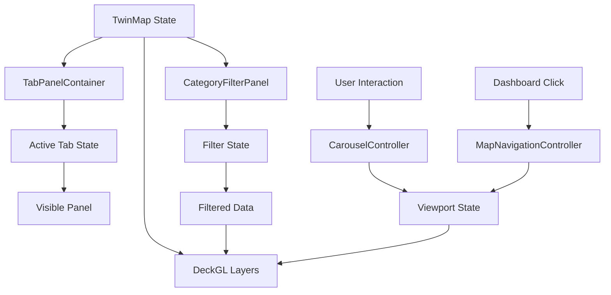

# 설계 문서: UI/UX 개선

## 개요

이 설계 문서는 디지털 트윈 지도 애플리케이션의 UI/UX 개선을 위한 기술적 설계를 정의합니다. 주요 개선 사항은 다음과 같습니다:

1. **탭 기반 패널 공유 시스템**: 여러 패널이 동일한 화면 영역을 공유하여 공간 충돌을 해결
2. **지도 네비게이션 개선**: 통계 테이블 클릭 시 해당 지역으로 자동 이동
3. **카테고리 필터링**: 관광 및 공사 데이터를 카테고리별로 필터링
4. **자동 순환 기능**: 카테고리 항목들을 자동으로 순환하며 표시
5. **반응형 UI 및 접근성**: WCAG 2.1 AA 기준 준수
6. **성능 최적화**: 메모이제이션 및 가상화를 통한 성능 개선

### 기술 스택

- **프론트엔드**: React 18+, TypeScript
- **지도 렌더링**: deck.gl, react-map-gl, MapLibre GL
- **클러스터링**: Supercluster
- **상태 관리**: React Hooks (useState, useRef, useMemo, useCallback)
- **스타일링**: Inline CSS with CSS-in-JS patterns

### 설계 목표

- 기존 컴포넌트 구조를 최대한 유지하면서 점진적으로 개선
- 성능 저하 없이 새로운 기능 추가
- 접근성 및 사용성 향상
- 코드 재사용성 및 유지보수성 향상

## 아키텍처

### 컴포넌트 계층 구조

```
TwinMap (메인 컨테이너)
├── DeckGL + MapGL (지도 렌더링)
├── TabPanelContainer (새로운 컴포넌트)
│   ├── TabGroup 1: 도로명/소통정보
│   │   ├── Tab: 도로명 → TwinRoadPanel
│   │   └── Tab: 소통정보 → TimeFilterPanel
│   └── TabGroup 2: 통계/링크
│       ├── Tab: 통계 → DashboardPanel (개선)
│       └── Tab: 링크 → TwinLinkPanel
├── CategoryFilterPanel (새로운 컴포넌트)
│   ├── TourismCategoryFilter
│   └── ConstructionCategoryFilter
├── CarouselController (새로운 Hook)
└── MapNavigationController (새로운 Hook)
```

### 데이터 흐름



### 상태 관리 전략

1. **로컬 상태 (useState)**
   - 활성 탭 인덱스
   - 필터 선택 상태
   - 순환 모드 활성화 여부
   - UI 토글 상태 (접힘/펼침)

2. **참조 (useRef)**
   - 타이머 및 인터벌 ID
   - 이전 viewport 상태
   - 순환 중인 항목 인덱스

3. **메모이제이션 (useMemo)**
   - 필터링된 데이터
   - 클러스터 계산 결과
   - 정렬된 통계 데이터

4. **콜백 메모이제이션 (useCallback)**
   - 이벤트 핸들러
   - 지도 네비게이션 함수
   - 필터 토글 함수

## 컴포넌트 및 인터페이스

### 1. TabPanelContainer

탭 기반 패널 전환을 관리하는 컨테이너 컴포넌트입니다.

```typescript
interface TabPanelContainerProps {
  position: 'top-left' | 'top-right' | 'bottom-left' | 'bottom-right';
  tabs: TabConfig[];
  defaultActiveIndex?: number;
  onTabChange?: (index: number) => void;
}

interface TabConfig {
  id: string;
  label: string;
  icon?: string;
  content: React.ReactNode;
  ariaLabel?: string;
}
```

**주요 기능:**
- 탭 클릭 시 활성 패널 전환
- 키보드 네비게이션 지원 (Arrow keys, Home, End)
- ARIA 속성을 통한 접근성 지원
- 활성 탭 시각적 강조

**구현 세부사항:**
- `role="tablist"`, `role="tab"`, `role="tabpanel"` 사용
- `aria-selected`, `aria-controls`, `aria-labelledby` 속성 설정
- 탭 전환 시 포커스 관리
- 최소 터치 타겟 크기 44x44px 보장

### 2. CategoryFilterPanel

관광 및 공사 카테고리 필터링을 제공하는 패널입니다.

```typescript
interface CategoryFilterPanelProps {
  tourismCategories: CategoryItem[];
  constructionCategories: CategoryItem[];
  selectedTourismCategories: Set<string>;
  selectedConstructionCategories: Set<string>;
  onTourismCategoryToggle: (category: string) => void;
  onConstructionCategoryToggle: (category: string) => void;
  onTourismCategoryPress: (category: string) => void;
  onConstructionCategoryPress: (category: string) => void;
  onTourismCategoryRelease: () => void;
  onConstructionCategoryRelease: () => void;
}

interface CategoryItem {
  id: string;
  label: string;
  icon?: string;
  color: string;
  count: number;
}
```

**주요 기능:**
- 카테고리 클릭 시 필터 토글
- 카테고리 길게 누르기 시 자동 순환 시작
- 다중 선택 지원
- 필터링된 항목 수 표시

**구현 세부사항:**
- `onMouseDown` / `onMouseUp` 이벤트로 길게 누르기 감지
- `onTouchStart` / `onTouchEnd` 이벤트로 모바일 지원
- 300ms 이상 누르면 자동 순환 모드 진입
- 시각적 피드백 (선택된 카테고리 강조)

### 3. useCarouselController Hook

카테고리 항목 자동 순환을 관리하는 커스텀 Hook입니다.

```typescript
interface CarouselConfig {
  items: CarouselItem[];
  interval: number; // milliseconds
  animationDuration: number; // milliseconds
  onItemChange: (item: CarouselItem, index: number) => void;
}

interface CarouselItem {
  id: string;
  coordinates: [number, number]; // [lng, lat]
  zoom?: number;
  data: any;
}

interface CarouselController {
  isActive: boolean;
  currentIndex: number;
  currentItem: CarouselItem | null;
  start: () => void;
  stop: () => void;
  next: () => void;
  previous: () => void;
  goTo: (index: number) => void;
}

function useCarouselController(config: CarouselConfig): CarouselController;
```

**주요 기능:**
- 지정된 간격으로 항목 자동 순환
- 마지막 항목 후 첫 번째 항목으로 순환
- 수동 조작 시 자동 순환 일시 중지
- 컴포넌트 언마운트 시 타이머 정리

**구현 세부사항:**
- `setInterval`을 사용한 자동 순환
- `useRef`로 타이머 ID 저장
- `useEffect` cleanup에서 타이머 정리
- 항목 변경 시 `onItemChange` 콜백 호출

### 4. useMapNavigation Hook

지도 viewport 제어를 관리하는 커스텀 Hook입니다.

```typescript
interface MapNavigationConfig {
  viewState: ViewState;
  setViewState: (viewState: ViewState) => void;
  animationDuration?: number;
}

interface ViewState {
  longitude: number;
  latitude: number;
  zoom: number;
  pitch?: number;
  bearing?: number;
}

interface MapNavigation {
  flyTo: (coordinates: [number, number], zoom?: number) => void;
  fitBounds: (bounds: [[number, number], [number, number]]) => void;
  animateTo: (viewState: Partial<ViewState>) => void;
}

function useMapNavigation(config: MapNavigationConfig): MapNavigation;
```

**주요 기능:**
- 특정 좌표로 부드럽게 이동
- 경계 박스에 맞춰 viewport 조정
- 애니메이션 지속 시간 설정

**구현 세부사항:**
- `transitionDuration` 속성을 사용한 애니메이션
- `transitionInterpolator`로 부드러운 전환
- 디바운싱을 통한 과도한 업데이트 방지

### 5. useCategoryFilter Hook

카테고리 필터링 로직을 관리하는 커스텀 Hook입니다.

```typescript
interface CategoryFilterConfig<T> {
  data: T[];
  getCategoryKey: (item: T) => string;
}

interface CategoryFilter<T> {
  selectedCategories: Set<string>;
  filteredData: T[];
  categories: Map<string, number>; // category -> count
  toggleCategory: (category: string) => void;
  selectCategories: (categories: string[]) => void;
  clearFilters: () => void;
  isFiltered: boolean;
}

function useCategoryFilter<T>(config: CategoryFilterConfig<T>): CategoryFilter<T>;
```

**주요 기능:**
- 카테고리별 데이터 필터링
- 다중 카테고리 선택 지원
- 필터링된 데이터 메모이제이션
- 카테고리별 항목 수 계산

**구현 세부사항:**
- `useMemo`로 필터링된 데이터 캐싱
- `Set`을 사용한 효율적인 선택 상태 관리
- 필터 변경 시에만 재계산

## 데이터 모델

### District Boundary Data

```typescript
interface DistrictBoundary {
  id: number;
  code: string;
  name: string;
  contour: [number, number][]; // polygon coordinates
  center: [number, number]; // [lng, lat]
  bounds: [[number, number], [number, number]]; // [[minLng, minLat], [maxLng, maxLat]]
}
```

### Tourism Category Data

```typescript
interface TourismCategory {
  id: string;
  name: string;
  icon: string;
  color: string;
}

interface TourismPoint {
  gid: number;
  lng: number;
  lat: number;
  content_name: string | null;
  district_name: string | null;
  category_name: string | null;
  place_name: string | null;
  title: string | null;
  subtitle: string | null;
  address: string | null;
  phone: string | null;
  operating_hours: string | null;
  fee_info: string | null;
  closed_days: string | null;
}
```

### Construction Category Data

```typescript
interface ConstructionCategory {
  id: string;
  name: string;
  icon: string;
  color: string;
}

interface ConstructionPoint {
  gid: number;
  lng: number;
  lat: number;
  project_name: string | null;
  progress_rate: number | null;
  plan_rate: number | null;
  achievement_rate: number | null;
  start_date: string | null;
  end_date: string | null;
  location_text: string | null;
  budget_text: string | null;
  d_day: number | null;
  summary: string | null;
  contact: string | null;
  field_code: string | null;
}
```

## 정확성 속성 (Correctness Properties)

이 기능은 주로 UI/UX 개선과 사용자 상호작용에 관한 것이므로, 전통적인 Property-Based Testing이 적합하지 않습니다. 대신 다음과 같은 테스트 전략을 사용합니다:

### UI 상태 관리 속성

일부 상태 관리 로직은 순수 함수로 추출하여 PBT를 적용할 수 있습니다:


*A property is a characteristic or behavior that should hold true across all valid executions of a system—essentially, a formal statement about what the system should do. Properties serve as the bridge between human-readable specifications and machine-verifiable correctness guarantees.*

### Property Reflection

prework 분석을 검토한 결과, 다음과 같은 속성들을 식별했습니다:

**필터링 관련 속성 (3.1, 3.2, 3.5, 3.6, 3.7):**
- 3.1과 3.2는 본질적으로 동일한 속성의 양면입니다 (필터링된 결과는 선택된 카테고리만 포함)
- 3.5는 다중 선택 시 합집합 동작을 검증합니다
- 3.6은 카운트 정확성을 검증합니다
- 3.7은 클러스터링 재계산을 검증합니다
- **통합 결정**: 3.1과 3.2를 하나의 포괄적인 속성으로 통합

**지도 네비게이션 관련 속성 (2.1, 2.2, 2.3):**
- 2.1은 올바른 좌표로 이동하는지 검증
- 2.2는 애니메이션 지속 시간 범위 검증
- 2.3은 줌 레벨 범위 검증
- **통합 결정**: 각각 독립적인 검증 가치가 있으므로 유지

**순환 관련 속성 (4.1, 4.4, 4.6, 4.7, 4.10):**
- 4.1은 첫 번째 항목 이동 검증
- 4.4는 순환 로직 검증
- 4.6은 애니메이션 지속 시간 검증
- 4.7은 UI 표시 검증
- 4.10은 줌 레벨 검증
- **통합 결정**: 4.6과 2.2는 동일한 애니메이션 지속 시간 검증이므로 하나로 통합 가능

최종적으로 다음 속성들을 유지합니다:

### Property 1: 카테고리 필터링 정확성

*For any* 데이터 세트와 선택된 카테고리 집합에 대해, 필터링된 결과의 모든 항목은 선택된 카테고리 중 하나에 속해야 하며, 선택되지 않은 카테고리의 항목은 포함되지 않아야 합니다.

**Validates: Requirements 3.1, 3.2**

### Property 2: 다중 카테고리 선택 합집합

*For any* 데이터 세트와 여러 선택된 카테고리에 대해, 필터링된 결과는 선택된 모든 카테고리에 속하는 항목들의 합집합이어야 합니다.

**Validates: Requirements 3.5**

### Property 3: 필터 카운트 정확성

*For any* 필터 상태에 대해, UI에 표시되는 항목 수는 실제 필터링된 데이터의 길이와 정확히 일치해야 합니다.

**Validates: Requirements 3.6**

### Property 4: 클러스터링 필터 일관성

*For any* 필터링된 데이터 세트에 대해, 생성된 클러스터의 모든 포인트는 필터링된 데이터에 속해야 합니다.

**Validates: Requirements 3.7**

### Property 5: 카테고리 토글 동작

*For any* 카테고리에 대해, 선택 → 선택 해제 순서를 수행하면 모든 항목이 표시되어야 합니다 (필터가 완전히 해제됨).

**Validates: Requirements 3.3**

### Property 6: District 클릭 시 좌표 이동

*For any* District 데이터에 대해, District 클릭 시 setViewState는 해당 District의 중심 좌표로 호출되어야 합니다.

**Validates: Requirements 2.1**

### Property 7: 지도 이동 애니메이션 지속 시간

*For any* 지도 이동 작업에 대해, transitionDuration은 200ms 이상 800ms 이하여야 합니다.

**Validates: Requirements 2.2, 4.6**

### Property 8: 줌 레벨 유효성

*For any* District 또는 순환 항목에 대해, 계산된 줌 레벨은 유효한 범위(10 이상 18 이하) 내에 있어야 합니다.

**Validates: Requirements 2.3, 4.10**

### Property 9: 순환 인덱스 계산

*For any* 양의 정수 리스트 길이 n에 대해, 인덱스 i가 마지막 항목(n-1)일 때 다음 인덱스는 0이어야 합니다 (순환).

**Validates: Requirements 4.4**

### Property 10: 순환 UI 표시 형식

*For any* 현재 인덱스 i와 전체 항목 수 n에 대해, 표시되는 텍스트는 "{i+1} / {n}" 형식이어야 합니다.

**Validates: Requirements 4.7**

## 에러 처리

### 1. 데이터 부재 처리

**시나리오**: District 경계 데이터가 없는 경우

**처리 방법**:
```typescript
function getDistrictCenter(district: DistrictBoundary | undefined): [number, number] {
  if (!district || !district.center) {
    // 기본 부산 중심 좌표
    return [129.0756, 35.1796];
  }
  return district.center;
}
```

**시나리오**: 카테고리에 항목이 없는 경우

**처리 방법**:
- 빈 배열 반환
- UI에 "항목 없음" 메시지 표시
- 순환 모드 비활성화

### 2. 타이머 정리

**시나리오**: 컴포넌트 언마운트 시 타이머가 계속 실행되는 경우

**처리 방법**:
```typescript
useEffect(() => {
  const timerId = setInterval(() => {
    // 순환 로직
  }, interval);

  return () => {
    clearInterval(timerId);
  };
}, [dependencies]);
```

### 3. 잘못된 좌표 처리

**시나리오**: 좌표가 유효하지 않은 경우 (NaN, Infinity, 범위 초과)

**처리 방법**:
```typescript
function isValidCoordinate(lng: number, lat: number): boolean {
  return (
    !isNaN(lng) && !isNaN(lat) &&
    isFinite(lng) && isFinite(lat) &&
    lng >= -180 && lng <= 180 &&
    lat >= -90 && lat <= 90
  );
}
```

### 4. 필터 상태 불일치

**시나리오**: 선택된 카테고리가 데이터에 존재하지 않는 경우

**처리 방법**:
- 존재하지 않는 카테고리는 자동으로 무시
- 유효한 카테고리만 필터링에 사용
- 사용자에게 경고 메시지 표시 (선택 사항)

### 5. 애니메이션 중단

**시나리오**: 애니메이션 진행 중 사용자가 수동으로 지도를 조작하는 경우

**처리 방법**:
- 자동 순환 일시 중지
- 현재 애니메이션 완료 허용
- 사용자 조작 우선순위 부여

## 테스트 전략

### 단위 테스트 (Unit Tests)

**도구**: Jest, React Testing Library

**테스트 대상**:
1. **순수 함수**:
   - 필터링 로직 (`filterByCategories`)
   - 좌표 계산 (`getDistrictCenter`, `calculateZoomLevel`)
   - 인덱스 계산 (`getNextIndex`, `getPreviousIndex`)
   - 유효성 검증 (`isValidCoordinate`, `isValidZoomLevel`)

2. **컴포넌트 렌더링**:
   - TabPanelContainer 초기 렌더링
   - CategoryFilterPanel 렌더링
   - 활성 탭 시각적 표시
   - 필터 카운트 표시

3. **이벤트 핸들러**:
   - 탭 클릭 이벤트
   - 카테고리 선택/해제
   - District 클릭
   - 키보드 네비게이션

**예제 테스트**:
```typescript
describe('filterByCategories', () => {
  it('should return only items matching selected categories', () => {
    const data = [
      { id: 1, category: 'A' },
      { id: 2, category: 'B' },
      { id: 3, category: 'A' },
    ];
    const selected = new Set(['A']);
    const result = filterByCategories(data, selected, (item) => item.category);
    expect(result).toHaveLength(2);
    expect(result.every(item => item.category === 'A')).toBe(true);
  });

  it('should return all items when no categories selected', () => {
    const data = [
      { id: 1, category: 'A' },
      { id: 2, category: 'B' },
    ];
    const selected = new Set<string>();
    const result = filterByCategories(data, selected, (item) => item.category);
    expect(result).toHaveLength(2);
  });
});
```

### 속성 기반 테스트 (Property-Based Tests)

**도구**: fast-check (JavaScript/TypeScript용 PBT 라이브러리)

**테스트 대상**: 위에서 정의한 10개의 Correctness Properties

**설정**:
- 최소 100회 반복 실행
- 각 테스트에 Feature 및 Property 태그 추가

**예제 테스트**:
```typescript
import fc from 'fast-check';

describe('Property 1: 카테고리 필터링 정확성', () => {
  /**
   * Feature: ui-ux-improvements, Property 1: 카테고리 필터링 정확성
   * For any 데이터 세트와 선택된 카테고리 집합에 대해,
   * 필터링된 결과의 모든 항목은 선택된 카테고리 중 하나에 속해야 하며,
   * 선택되지 않은 카테고리의 항목은 포함되지 않아야 합니다.
   */
  it('filtered results contain only selected categories', () => {
    fc.assert(
      fc.property(
        // 임의의 데이터 생성
        fc.array(
          fc.record({
            id: fc.integer(),
            category: fc.constantFrom('A', 'B', 'C', 'D', 'E'),
            data: fc.string(),
          })
        ),
        // 임의의 카테고리 선택
        fc.array(fc.constantFrom('A', 'B', 'C', 'D', 'E'), { minLength: 1 }),
        (data, selectedArray) => {
          const selected = new Set(selectedArray);
          const result = filterByCategories(data, selected, (item) => item.category);
          
          // 모든 결과 항목이 선택된 카테고리에 속하는지 확인
          return result.every(item => selected.has(item.category));
        }
      ),
      { numRuns: 100 }
    );
  });
});

describe('Property 9: 순환 인덱스 계산', () => {
  /**
   * Feature: ui-ux-improvements, Property 9: 순환 인덱스 계산
   * For any 양의 정수 리스트 길이 n에 대해,
   * 인덱스 i가 마지막 항목(n-1)일 때 다음 인덱스는 0이어야 합니다.
   */
  it('wraps around to 0 after last index', () => {
    fc.assert(
      fc.property(
        fc.integer({ min: 1, max: 1000 }), // 리스트 길이
        (length) => {
          const lastIndex = length - 1;
          const nextIndex = getNextIndex(lastIndex, length);
          return nextIndex === 0;
        }
      ),
      { numRuns: 100 }
    );
  });

  it('increments normally for non-last indices', () => {
    fc.assert(
      fc.property(
        fc.integer({ min: 2, max: 1000 }), // 리스트 길이 (최소 2)
        fc.integer({ min: 0, max: 998 }), // 현재 인덱스 (마지막이 아님)
        (length, currentIndex) => {
          fc.pre(currentIndex < length - 1); // 마지막 인덱스가 아닌 경우만
          const nextIndex = getNextIndex(currentIndex, length);
          return nextIndex === currentIndex + 1;
        }
      ),
      { numRuns: 100 }
    );
  });
});
```

### 통합 테스트 (Integration Tests)

**도구**: Jest, React Testing Library, @testing-library/user-event

**테스트 대상**:
1. **탭 전환 플로우**:
   - 탭 클릭 → 패널 전환 → 포커스 이동
   - 키보드 네비게이션 → 탭 전환

2. **필터링 플로우**:
   - 카테고리 선택 → 데이터 필터링 → 클러스터 재계산 → 지도 업데이트

3. **순환 플로우**:
   - 카테고리 길게 누르기 → 순환 시작 → 항목 이동 → 순환 중지

4. **지도 네비게이션 플로우**:
   - District 클릭 → viewport 이동 → 애니메이션 완료

**예제 테스트**:
```typescript
describe('Tab switching integration', () => {
  it('switches panel and moves focus when tab is clicked', async () => {
    const user = userEvent.setup();
    render(<TabPanelContainer tabs={mockTabs} />);
    
    const tab2 = screen.getByRole('tab', { name: '소통정보' });
    await user.click(tab2);
    
    // 패널이 전환되었는지 확인
    expect(screen.getByRole('tabpanel', { name: '소통정보' })).toBeVisible();
    
    // 포커스가 이동했는지 확인
    expect(screen.getByRole('tabpanel', { name: '소통정보' })).toHaveFocus();
  });
});
```

### 접근성 테스트 (Accessibility Tests)

**도구**: jest-axe, @testing-library/react

**테스트 대상**:
1. ARIA 속성 존재 여부
2. 키보드 네비게이션
3. 색상 대비
4. 터치 타겟 크기
5. 스크린 리더 지원

**예제 테스트**:
```typescript
import { axe, toHaveNoViolations } from 'jest-axe';

expect.extend(toHaveNoViolations);

describe('Accessibility', () => {
  it('should not have accessibility violations', async () => {
    const { container } = render(<TabPanelContainer tabs={mockTabs} />);
    const results = await axe(container);
    expect(results).toHaveNoViolations();
  });

  it('supports keyboard navigation', async () => {
    const user = userEvent.setup();
    render(<TabPanelContainer tabs={mockTabs} />);
    
    const firstTab = screen.getAllByRole('tab')[0];
    firstTab.focus();
    
    // Arrow Right로 다음 탭으로 이동
    await user.keyboard('{ArrowRight}');
    expect(screen.getAllByRole('tab')[1]).toHaveFocus();
    
    // Arrow Left로 이전 탭으로 이동
    await user.keyboard('{ArrowLeft}');
    expect(firstTab).toHaveFocus();
  });
});
```

### 성능 테스트 (Performance Tests)

**도구**: Jest, React Testing Library, performance.now()

**테스트 대상**:
1. 필터링 성능 (100ms 이내)
2. 대량 데이터 렌더링 (1000개 이상)
3. 메모이제이션 효과
4. 타이머 정리

**예제 테스트**:
```typescript
describe('Performance', () => {
  it('filters data within 100ms', () => {
    const largeDataset = Array.from({ length: 10000 }, (_, i) => ({
      id: i,
      category: ['A', 'B', 'C', 'D', 'E'][i % 5],
    }));
    
    const start = performance.now();
    const result = filterByCategories(
      largeDataset,
      new Set(['A', 'B']),
      (item) => item.category
    );
    const end = performance.now();
    
    expect(end - start).toBeLessThan(100);
    expect(result.length).toBeGreaterThan(0);
  });

  it('memoizes filtered data', () => {
    const { rerender } = render(<CategoryFilterPanel {...mockProps} />);
    
    const firstRenderCount = mockFilterFunction.mock.calls.length;
    
    // 동일한 props로 재렌더링
    rerender(<CategoryFilterPanel {...mockProps} />);
    
    const secondRenderCount = mockFilterFunction.mock.calls.length;
    
    // 필터 함수가 다시 호출되지 않았는지 확인
    expect(secondRenderCount).toBe(firstRenderCount);
  });
});
```

### 테스트 커버리지 목표

- **라인 커버리지**: 80% 이상
- **브랜치 커버리지**: 75% 이상
- **함수 커버리지**: 85% 이상
- **속성 테스트**: 모든 Correctness Properties 100% 구현

## 구현 계획

### Phase 1: 기반 컴포넌트 및 Hooks (1-2일)

1. **TabPanelContainer 컴포넌트**
   - 기본 탭 전환 기능
   - 키보드 네비게이션
   - ARIA 속성

2. **useCategoryFilter Hook**
   - 필터링 로직
   - 메모이제이션
   - 다중 선택 지원

3. **useMapNavigation Hook**
   - viewport 제어
   - 애니메이션 설정
   - 좌표 유효성 검증

### Phase 2: 필터링 및 UI 개선 (2-3일)

1. **CategoryFilterPanel 컴포넌트**
   - 카테고리 목록 렌더링
   - 선택/해제 토글
   - 카운트 표시

2. **TwinMap 통합**
   - 기존 패널을 TabPanelContainer로 래핑
   - 필터 상태 연결
   - 클러스터링 재계산

3. **DashboardPanel 개선**
   - District 클릭 이벤트 추가
   - 지도 네비게이션 연결

### Phase 3: 자동 순환 기능 (2-3일)

1. **useCarouselController Hook**
   - 자동 순환 로직
   - 타이머 관리
   - 수동 조작 감지

2. **CategoryFilterPanel 확장**
   - 길게 누르기 감지
   - 순환 모드 UI
   - 진행 상태 표시

3. **지도 연동**
   - 항목별 viewport 이동
   - 줌 레벨 자동 조정
   - 툴팁/패널 업데이트

### Phase 4: 접근성 및 성능 최적화 (1-2일)

1. **접근성 개선**
   - ARIA 속성 추가
   - 키보드 네비게이션 완성
   - 색상 대비 조정
   - prefers-reduced-motion 지원

2. **성능 최적화**
   - 메모이제이션 적용
   - 디바운싱 추가
   - 가상화 (필요 시)

3. **테스트 작성**
   - 단위 테스트
   - 속성 기반 테스트
   - 통합 테스트
   - 접근성 테스트

### Phase 5: 테스트 및 버그 수정 (1-2일)

1. **테스트 실행 및 검증**
2. **버그 수정**
3. **성능 프로파일링**
4. **문서화**

**총 예상 기간**: 7-12일

## 의존성

### 새로운 패키지

```json
{
  "dependencies": {
    // 기존 패키지 유지
  },
  "devDependencies": {
    "fast-check": "^3.15.0",
    "jest-axe": "^8.0.0",
    "@testing-library/user-event": "^14.5.1"
  }
}
```

### 기존 패키지

- React 18+
- TypeScript
- deck.gl
- react-map-gl
- Supercluster
- Jest
- React Testing Library

## 위험 요소 및 완화 전략

### 1. 성능 저하

**위험**: 대량의 데이터 필터링 및 클러스터링 재계산으로 인한 성능 저하

**완화 전략**:
- useMemo를 사용한 메모이제이션
- 디바운싱 적용
- Web Worker 사용 고려 (필요 시)
- 성능 프로파일링 및 최적화

### 2. 메모리 누수

**위험**: 타이머 및 이벤트 리스너가 정리되지 않아 메모리 누수 발생

**완화 전략**:
- useEffect cleanup 함수에서 모든 타이머 정리
- 이벤트 리스너 제거
- 메모리 프로파일링

### 3. 접근성 미준수

**위험**: WCAG 2.1 AA 기준을 충족하지 못함

**완화 전략**:
- jest-axe를 사용한 자동화된 접근성 테스트
- 수동 스크린 리더 테스트
- 키보드 네비게이션 테스트
- 색상 대비 검증 도구 사용

### 4. 브라우저 호환성

**위험**: 특정 브라우저에서 동작하지 않음

**완화 전략**:
- 주요 브라우저(Chrome, Firefox, Safari, Edge)에서 테스트
- Polyfill 사용
- 기능 감지 및 대체 구현

### 5. 복잡한 상태 관리

**위험**: 여러 상태가 얽혀 버그 발생

**완화 전략**:
- 상태를 작은 단위로 분리
- 커스텀 Hook으로 로직 캡슐화
- 상태 변경 로직을 순수 함수로 추출
- 철저한 단위 테스트

## 향후 개선 사항

1. **Redux 또는 Zustand 도입**: 복잡한 전역 상태 관리가 필요한 경우
2. **애니메이션 라이브러리**: Framer Motion 등을 사용한 더 부드러운 애니메이션
3. **가상화**: react-window 또는 react-virtualized를 사용한 대량 데이터 렌더링 최적화
4. **오프라인 지원**: Service Worker를 사용한 오프라인 기능
5. **다국어 지원**: i18n 라이브러리 도입
6. **사용자 설정 저장**: LocalStorage 또는 서버에 사용자 설정 저장
7. **고급 필터링**: 날짜 범위, 검색, 정렬 등 추가 필터 옵션

## 결론

이 설계는 기존 디지털 트윈 지도 애플리케이션의 UI/UX를 점진적으로 개선하면서도 성능과 접근성을 유지하는 것을 목표로 합니다. 탭 기반 패널 시스템, 카테고리 필터링, 자동 순환 기능을 통해 사용자 경험을 크게 향상시킬 수 있습니다.

주요 설계 원칙:
- **점진적 개선**: 기존 코드를 최대한 유지하면서 새로운 기능 추가
- **성능 우선**: 메모이제이션, 디바운싱 등을 통한 성능 최적화
- **접근성 준수**: WCAG 2.1 AA 기준 충족
- **테스트 가능성**: 순수 함수 추출 및 속성 기반 테스트 적용
- **유지보수성**: 커스텀 Hook을 통한 로직 캡슐화

이 설계를 따라 구현하면 사용자에게 더 나은 경험을 제공하면서도 코드 품질과 유지보수성을 유지할 수 있습니다.
